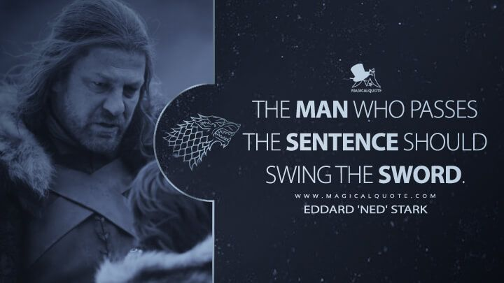

# September 28, 2025

When you make a key decision as a leader, take ownership by personally communicating it and acting on it. 

Avoid passing that responsibility to a subordinate or colleague. 

Doing so not only reflects ineffective leadership but also signals a lack of courage, which can erode trust over time. 
Team members often pick up on this avoidance, leading to resentment and diminished morale. 

In the end, this habit can swiftly undermine the effectiveness of middle management in any organization, making it harder to inspire and retain top talent.

Just be more like Ned Stark

---

## Media

---

[View original post on LinkedIn](https://www.linkedin.com/feed/update/urn:li:activity:7375866764850540545/)