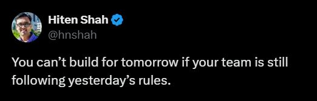

# October 28, 2025

By leading engineering teams through acquisitions and transformations, I've seen firsthand how clinging to outdated processes stifles innovation. 

It's all about evolving your team's playbook to embrace what's next, especially with AI reshaping how we build software.

Leaders need to make an effort to keep updated, following trends while separating the hype from the value delivering changes. And then show by example to their teams how to adopt.

credit: Hiten Shah on X

---

## Media

---

[View original post on LinkedIn](https://www.linkedin.com/feed/update/urn:li:activity:7382413803537448960/)