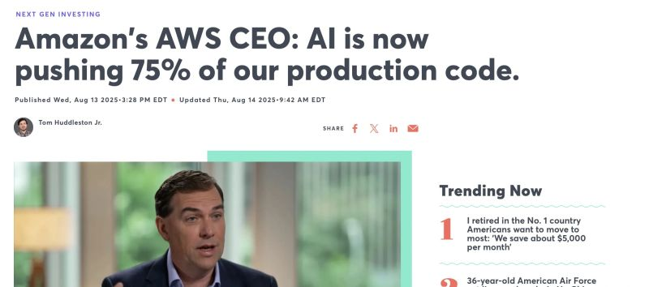

# October 28, 2025

I'm sure that has nothing to do with today's AWS outage..
Just a mere coincidence.

---

## Media

---

[View original post on LinkedIn](https://www.linkedin.com/feed/update/urn:li:activity:7386017310748164096/)