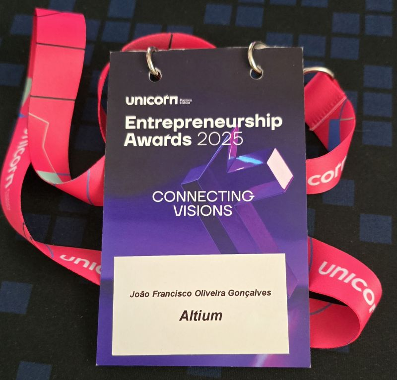
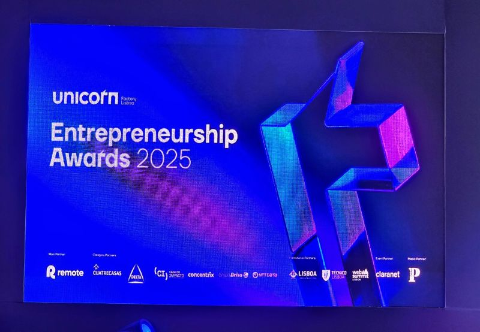

# October 28, 2025

Yesterday I was at the Entrepreneurship Awards 2025 by Unicorn Factory Lisboa, and got really excited about the future of the Portuguese startup ecosystem.

Great pitches, a lot of success stories and overall an energy and will to succeed and bring change to the world.

Also, for me was a chance to takl in person again with great people like Ricardo Luiz, Claudio Menezes and Hugo H. Macedo 🔥⚒️🚀 and a few more.

---

## Media

---

[View original post on LinkedIn](https://www.linkedin.com/feed/update/urn:li:activity:7387441189215535104/)