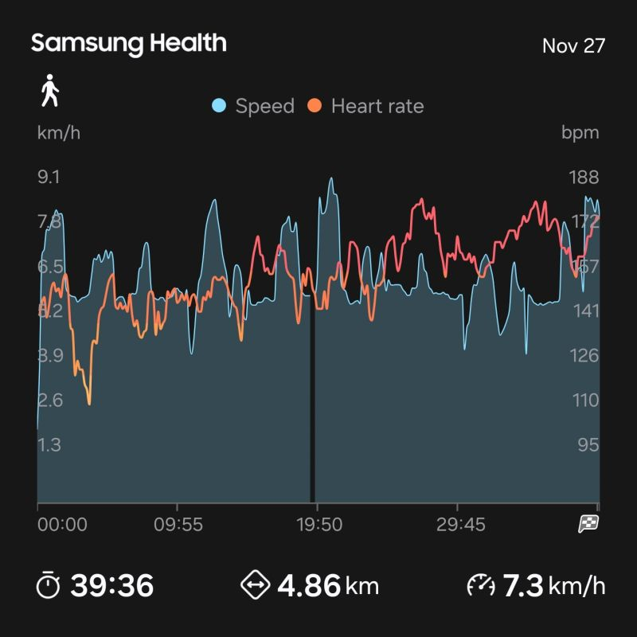

# November 27, 2025

A more personal post today.

I've started running 2 months ago, and back the 
struggled to do this course in under 50 minutes. 

Today I finally broke the 40 minutes mark.
Still a long way to go, but for now morale is sky high.

I also found out that it brings so much clarity, I can get into deep thoughts about work, life, etc..
It also kicks off the day on high energy that I've never had in the morning.

Highly everyone to get started, pick your poison of exercise and keep pushing. 💪

---

## Media

---

[View original post on LinkedIn](https://www.linkedin.com/feed/update/urn:li:activity:7399736576563490816/)