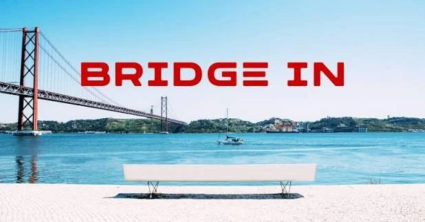

# November 27, 2025

After 7 very challenging but fulfilling years at Valispace GmbH and more recently at Altium®, I've decided to embrace a new challenge. 

I'll be forever grateful to Marco Witzmann and Louise Lindblad for the opportunity and support, as well as everyone else that was part of the team throughout the years (too many to mention) for all the smiles, tears laughs and hugs we went through.

Now a new project ahead at BRIDGE IN where I hope to bring the company to next level, more news to come soon.

---

## Media

---

[View original post on LinkedIn](https://www.linkedin.com/feed/update/urn:li:activity:7396104719816970241/)