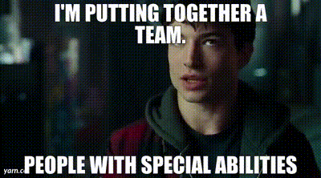

# November 27, 2025

I'm putting togther a team..

If you are someone that enjoys fast pace development and contributing to all parts of the development cycle:
- from product discovery, to UI crafting, to backend architecture all the way to container optimization, with evertything in between and beyond
this is the place to be.

At BRIDGE IN we are trying to solve company buerocracy to help people focus on building and their lives, it's a huge beast to kill and we need people with the passion and will to do it.

Past experience on any specific stack is not super relevant, willing and speed of learning will get you through. 

If you read so far, I'll assume you are interested, link to apply in the comments.

---

## Media

---

[View original post on LinkedIn](https://www.linkedin.com/feed/update/urn:li:activity:7396814586798075904/)