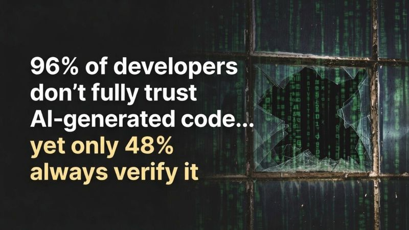

# January 26, 2026

A new Sonar survey highlights a concerning trust gap in AI coding: while 96% of developers doubt the functional correctness of AI-generated code, less than half consistently review it before committing.

When AI-generated code slips through without proper checks, it’s like leaving up a broken window in the codebase, quickly leading to unchecked technical debt that undermines system stability and security.

To prevent this I treat AI as a capable but still learning developer. Here’s how:

- Prompt scaffolding: Clear, detailed instructions with architectural boundaries make a world of difference.

- CLAUDE .md files: Persistent context to keep the AI aligned with our team’s exact standards and style.

- Three levels of review:
 1️⃣ Automatic checks—linters and security scanners catch the straightforward issues.
 2️⃣ Developer review—someone looks at logic, correctness, and corner cases.
 3️⃣ Peer review—another developr assesses fit with overall design and maintainability, correcting for bias.

Managing AI output is quickly becoming a core leadership challenge. Treating it as a junior engineer who needs hands-on guidance, not a black box to blindly trust, is essential for sustainable quality.

---

## Media

---

[View original post on LinkedIn](https://www.linkedin.com/feed/update/urn:li:activity:7416751057080569856/)