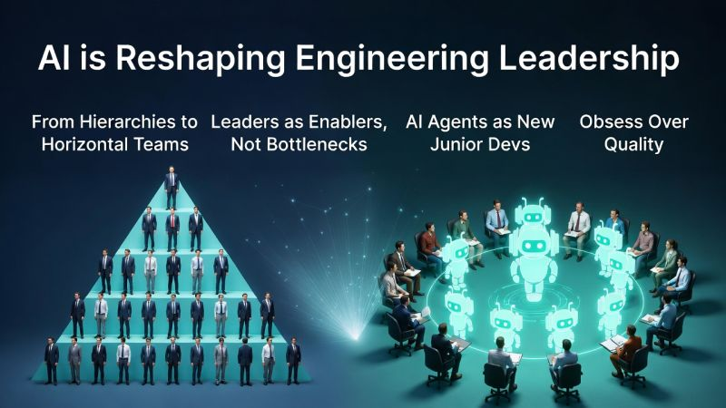

# January 26, 2026

As I'm building a new team at BRIDGE IN, I've been thinking a lot about how AI is reshaping engineering leadership.

AI is influencing more than just how we write code, it’s also affecting how we lead and structure our teams. The old hierarchies are starting to feel cumbersome.

Here are a few shifts I’m noticing:

💡 From hierarchies to horizontal teams: Instead of a tall pyramid, we're moving toward flatter setups where each developer can lead their own small group of AI agents.

🛡️ **Leaders as enablers, not bottlenecks: Instead of micromanaging output, we focus on setting the guardrails—the architectural rules and prompt libraries that guide the agents. We become the ones who evaluate new tools and cut through the noise.

👶 AI agents are your new junior devs: Fast and full of potential, but they still need solid guidance, code reviews, and mentorship. Without that, they can churn out a mountain of technical deb or “slop.”

✅ Obsess over quality: When AI is part of the team, feeling responsible for code quality becomes even more critical. We have to step up to keep low-quality AI-generated output in check.

Your job is to help your team use AI effectively, safely, and yes even enjoyably.

hashtag
#ai 
hashtag
#leadership 
hashtag
#agents

**Hashtags:** #agents #ai #leadership

---

## Media

---

[View original post on LinkedIn](https://www.linkedin.com/feed/update/urn:li:activity:7419295177707782144/)