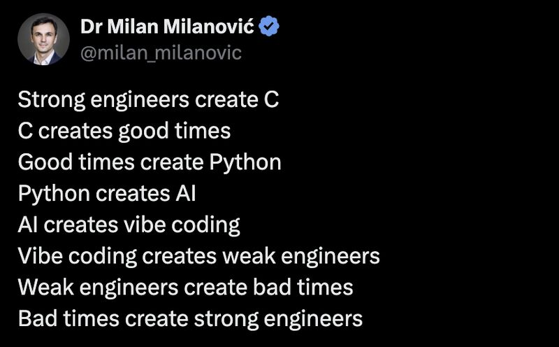

# January 26, 2026

For a bit of less serious post.. (we all need some fun)

We're officially in the "vibe coding" era — where Ctrl+K generates better code than your junior dev, but nobody knows why it works.

Question is… are we about to hit the bad times phase? 👀

Tag a fellow engineer who’s currently vibing their way through a codebase.

credits to Dr Milan Milanović

hashtag
#SoftwareEngineering 
hashtag
#humor 
hashtag
#Python 
hashtag
#AI

**Hashtags:** #SoftwareEngineering #Python #AI #humor

---

## Media

---

[View original post on LinkedIn](https://www.linkedin.com/feed/update/urn:li:activity:7420397244069109760/)