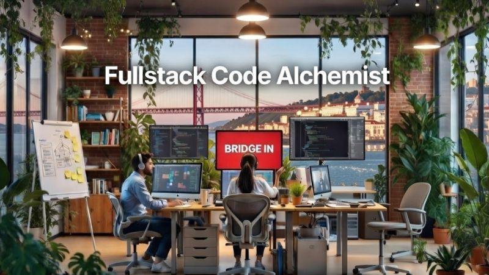

# January 26, 2026

New Year, New Chapter: Build Something That Matters in 2026! 

It’s January 2026, and if one of your resolutions is to grow as a developer, to work on real challenges, own your work, and see the direct impact of your code, we might have the perfect opportunity for you in a small, high-trust team that moves fast.

At BRIDGE IN we’re looking for a Fullstack Code Alchemist (yes, the title is a bit playful because we like to have a litle bit of fun).
This is a fast-paced, demanding environment where you’ll build features from scratch, own them end-to-end (UI to infrastructure), and solve genuine user problems using the most recent tech (AI usage is encouraged). 

We care much more about your ability to deliver impact than about being married to a specific stack or framework. That said, if you have a strong frontend sensibility and love crafting clean, user-friendly experiences, that’s a real plus.

Full remote (Portugal-based is highly preferable), with occasional fun off-sites, competitive salary + bonus, private health insurance, and the chance to leave a real mark on a product that helps local economies grow.

We’d love to hear from you. 
Drop a comment or DM if you’re curious, happy new year and happy coding! 🚀

---

## Media

---

[View original post on LinkedIn](https://www.linkedin.com/feed/update/urn:li:activity:7414587861120753664/)