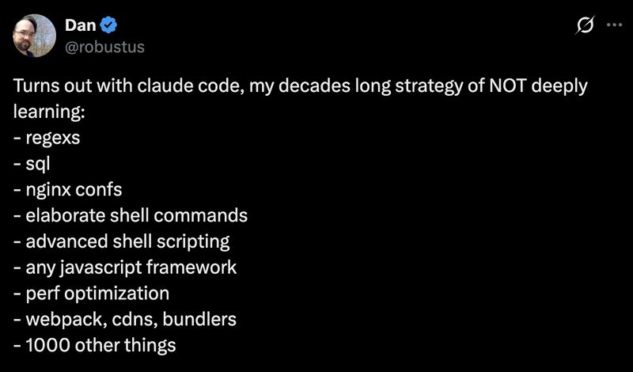

# February 25, 2026

People are dunking on this post but I think they're missing the point.
The keyword is "deeply."

(almost) Nobody deeply learns nginx configs. You learn enough to know what nginx does, when you need it, and how to find the right config when the time comes. Same with regex. Same with webpack. Same with 90% of the stuff on that list.

Generalists have always operated this way. Wide knowledge, shallow depth, good instincts for when to dig deeper.

AI just takes over the digging part. 
But you still need to know where to dig. You still need to recognize when the AI is confidently solving the wrong problem.

The value now is awareness. Knowing what tools exist. Knowing what's possible. Knowing enough to validate or redirect.

You don't need to mass memorize grep syntax. You need to know grep exists and when it's the right tool.

That's always been the game. AI just made it more obvious.

hashtag
#AI 
hashtag
#SoftwareDevelopment 
hashtag
#regex

**Hashtags:** #regex #SoftwareDevelopment #AI

---

## Media

---

[View original post on LinkedIn](https://www.linkedin.com/feed/update/urn:li:activity:7428007104575070208/)