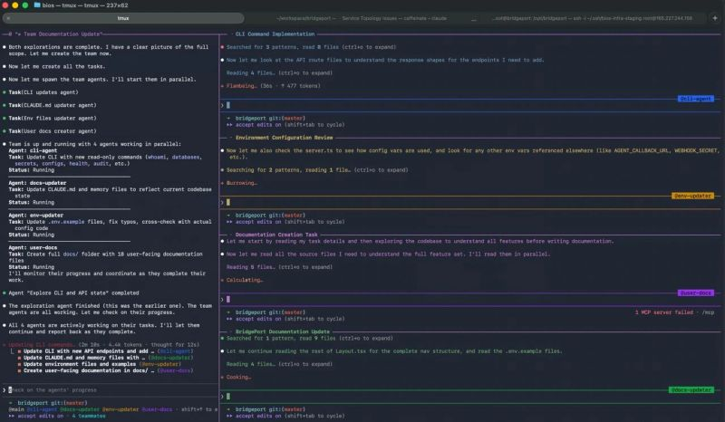

# February 25, 2026

Trying out the new Claude Code "Agents team" feature..

Early results are good, saves a lot of orchestration work that I was doing with skills and local files, because the agents can talk to each other and the team lead keeps track of progress.

Going to have to rethink our current development workflow at BRIDGE IN around this, Im mostly interested in the ability to run parallel then sequential and with review/improvement loops, and some adversarial concensus in final approval. 

But.. it does it up tokens like there's no tomorrow. right now only feasible for max plans IMO.

Exciting times.. tokens go brrrr....

ps: in the image is 1 team lead and 4 parallel distinct workers doing separate tasks.

---

## Media

---

[View original post on LinkedIn](https://www.linkedin.com/feed/update/urn:li:activity:7425874644961984512/)