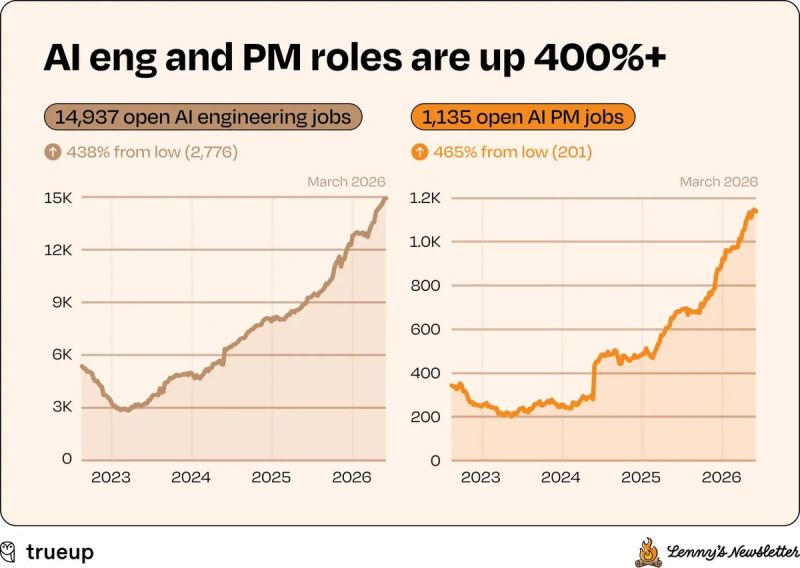

# March 26, 2026

Lenny Rachitsky just dropped his latest job market data and the numbers are worth sitting with for a minute.

PM openings at a three-year high. Engineering up 78% from the low. AI roles up over 300%. Recruiter demand surging back toward 2022 peaks, which is the leading indicator nobody pays attention to. Companies don't staff up recruiting to slow down.

And then there's design. Flat since early 2023. Same industry, same AI wave. PM and engineering started climbing in 2024. Design just... didn't.

Lenny's take is that AI lets engineers move so fast there's less room for the traditional design process. Fair. But I'd add something. 
PMs and engineers adopted AI tools early and changed how they work. The design community spent two years debating whether those tools should exist at all.
That debate matters. But the market kept moving while it happened.

When you can prototype and ship faster than ever, the question shifts from "how should this look" to "what should we build." One discipline leaned into that shift. The other one is still processing it.

The data doesn't care about the discourse. It just reflects who adapted.

---

## Media

---

[View original post on LinkedIn](https://www.linkedin.com/feed/update/urn:li:activity:7442578302529142784/)