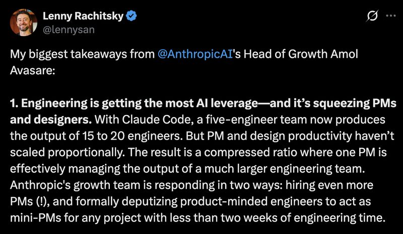

# April 07, 2026

From the most recent episode Lenny Rachitsky shared Anthropic numbers: a five-engineer team with Claude Code now produces the output of 15 to 20 engineers.

That's impressive. But the more interesting number is the one they didn't highlight.
PM and design productivity haven't scaled proportionally. Same team, same processes, same capacity. The engineers just got three to four times faster.

So Anthropic is doing two things: hiring more PMs, and deputizing product-minded engineers as mini-PMs for smaller projects.

The bottleneck didn't disappear. It moved.

For years, engineering was the constraint. Need a feature? Get in the backlog. Wait your turn. Every org optimized around that assumption. Product, design, prioritization frameworks, sprint planning. All of it built for a world where engineering capacity was scarce.

That world is gone. 
Engineering capacity tripled (or more) overnight and the rest of the org is still running at 1x, at best.

The orgs that figure this out early won't just ship faster. 
They'll stop wasting their newly abundant engineering cycles waiting on a spec that's three sprints behind.

---

## Media

---

[View original post on LinkedIn](https://www.linkedin.com/feed/update/urn:li:activity:7447179358802333696/)