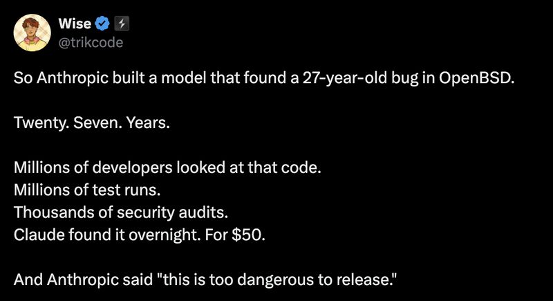

# April 09, 2026

The best thing you can say about your product in 2026 is "we can't let people use this."

Anthropic built a model, Mythos, that found a 27-year-old bug in OpenBSD. Overnight. For $50. And their move was to call it too dangerous to release.

Smart safety call. Also the hardest thing to manufacture in marketing: genuine fear.

Every AI lab is now in an arms race to be the most responsibly terrifying. OpenAI publishes safety cards. Google delays releases citing "dual-use concerns." Anthropic says their model is so good it scares them.

The safety concern is probably real. A model that finds zero-days in battle-tested codebases can find zero-days everywhere. That's worth taking seriously.

But "too dangerous to release" also does something else. It tells the market: 
we're ahead. Not by benchmarks. Not by vibes. By the only metric that matters now. Capability so advanced we have to hold it back.

The model doesn't need to ship to win. The headline already did the work.

hashtag
#AI 
hashtag
#Mythos 
hashtag
#Security

**Hashtags:** #AI #Security #Mythos

---

## Media

---

[View original post on LinkedIn](https://www.linkedin.com/feed/update/urn:li:activity:7448011089335898112/)