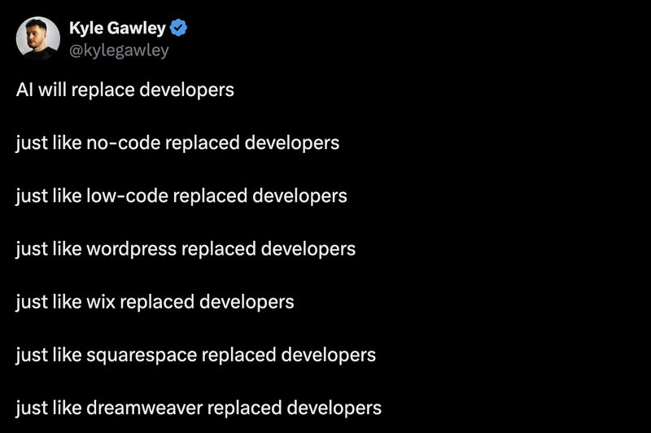

# April 10, 2026

The funny part is every single item on that list created more developer jobs, not fewer.

WordPress didn't replace developers. It spawned an entire ecosystem of them. Squarespace handles the sites that were never going to hire a developer anyway. No-code? Companies adopt it, hit the ceiling in six months, then hire a developer to build the thing they actually needed.

The list of technologies that were supposed to kill us is also, somehow, our resume.

AI will probably do the same. More software gets built. More of it needs people who understand what it's doing.

credits: Kyle Gawley on X

hashtag
#ai 
hashtag
#softwaredevelopment 
hashtag
#coding

**Hashtags:** #ai #coding #softwaredevelopment

---

## Media

---

[View original post on LinkedIn](https://www.linkedin.com/feed/update/urn:li:activity:7448270253517680640/)