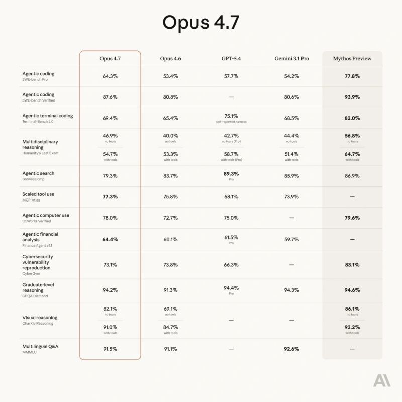

# April 16, 2026

Claude just introduced Claude Opus 4.7, their most capable Opus model yet.

It handles long-running tasks with more rigor, follows instructions more precisely, and verifies its own outputs before reporting back.

You can hand off your hardest work with less supervision. 

Opus 4.7 also has substantially better vision. It can see images at more than three times the resolution and produces higher-quality interfaces, slides, and docs as a result.

hashtag
#AI 
hashtag
#Claude

**Hashtags:** #AI #Claude

---

## Media

---

[View original post on LinkedIn](https://www.linkedin.com/feed/update/urn:li:activity:7450597079976091648/)