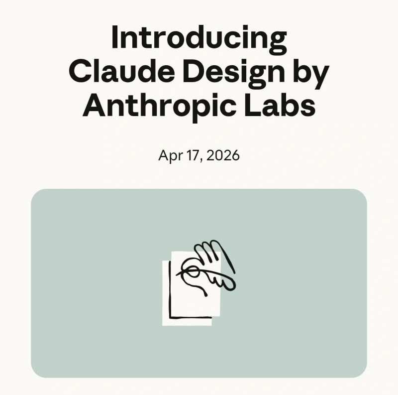

# April 17, 2026

They're at it again. 
Just one day after Opus 4.7, now a full design, presentations, chart creation and much more tool.

Describe what you want, and Claude builds the first version. Refine through conversation, inline comments, direct edits, or custom sliders.

Export to Canva, as PDF or PPTX, or hand off to Claude Code when the design feels right.

Crazy pace of delivery. 

(link in comments)

hashtag
#AI 
hashtag
#Claude

**Hashtags:** #AI #Claude

---

## Media

---

[View original post on LinkedIn](https://www.linkedin.com/feed/update/urn:li:activity:7450926839323070464/)