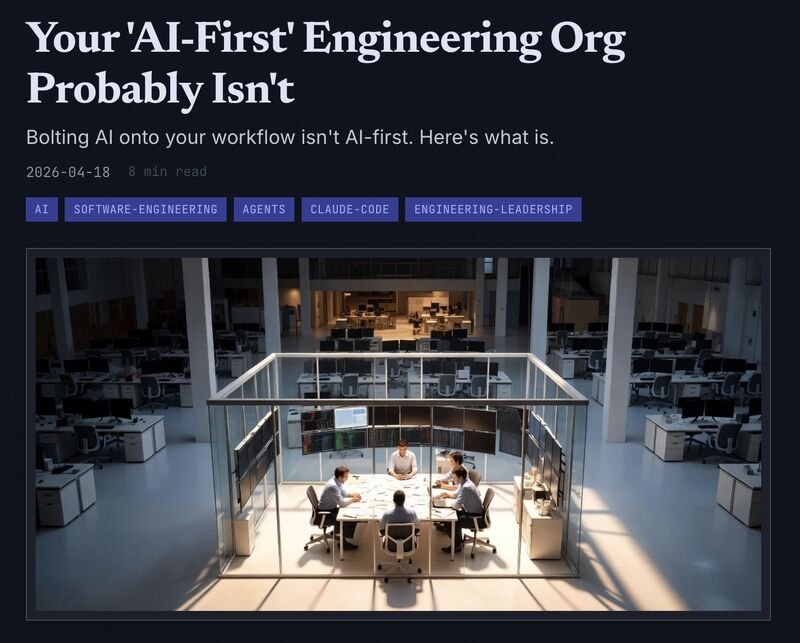

# April 18, 2026

Most teams calling themselves AI-first are AI-assisted.

Same sprint cycles, same manual reviews, same weekly status call, now with Co-Pilot. Ten or twenty percent efficiency gain. Nothing structurally changes.

AI-first means you redesigned the loop from the ground up, from 1st principles.
The difference is multiplicative.

At BRIDGE IN, three engineers and roughly fifteen AI agents merged over a hundred PRs in the last two weeks. A year ago that pace was physically impossible. This caused pression on other parts of the organization, now we are fixing those, and the improvement loop begins.

Only when you allow a team to increase their output can you see where you where the pressure builds up, and you go and fix that.

Wrote up how, and the awkward findings that came with the change.

Link in the comments.

hashtag
#ai 
hashtag
#softwareengineering 
hashtag
#leadership 
hashtag
#changemanagement

**Hashtags:** #changemanagement #leadership #ai #softwareengineering

---

## Media

---

[View original post on LinkedIn](https://www.linkedin.com/feed/update/urn:li:activity:7451240981456285696/)