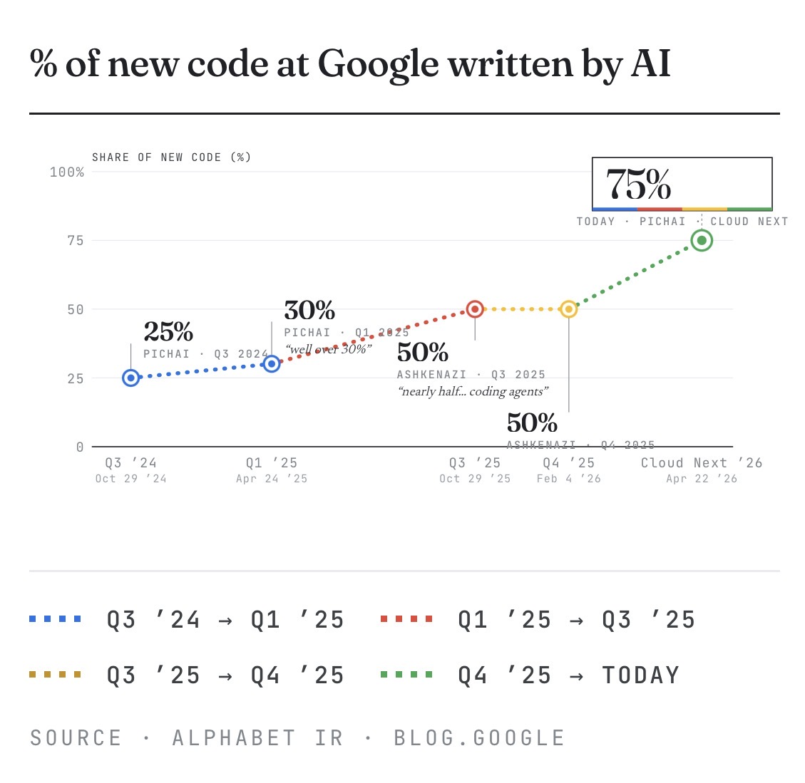
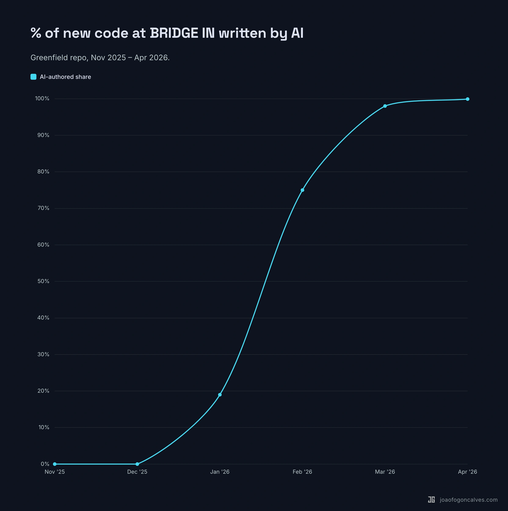

At Cloud Next Pichai showed this chart. 25% to 75% of new code at Google written by AI in 18 months.

I pulled the same number for our codebase at BRIDGE IN over the same window. Different shape entirely.

Five-month-old greenfield repo. The first two months: 0% AI, because there was nothing to assist with yet. Then AI authorship climbed: 19% in January, ~75% in February, 98% in March, 99.9% this month.

Both numbers are real. They're measuring different problems.

Google retrofitted AI into 25 years of code, hundreds of thousands of engineers, and rollout pipelines that have to survive change management and legal review. 75% there is a serious operational achievement.

A small team on a fresh codebase with AI-native conventions from week one doesn't have that ceiling. We didn't beat Google. We're not playing the same game.

If you're benchmarking your % against Google's, what you're really comparing is your constraints to theirs.

**Hashtags:** #AI #SoftwareEngineering #Greenfield #AICoding

---

## Media

