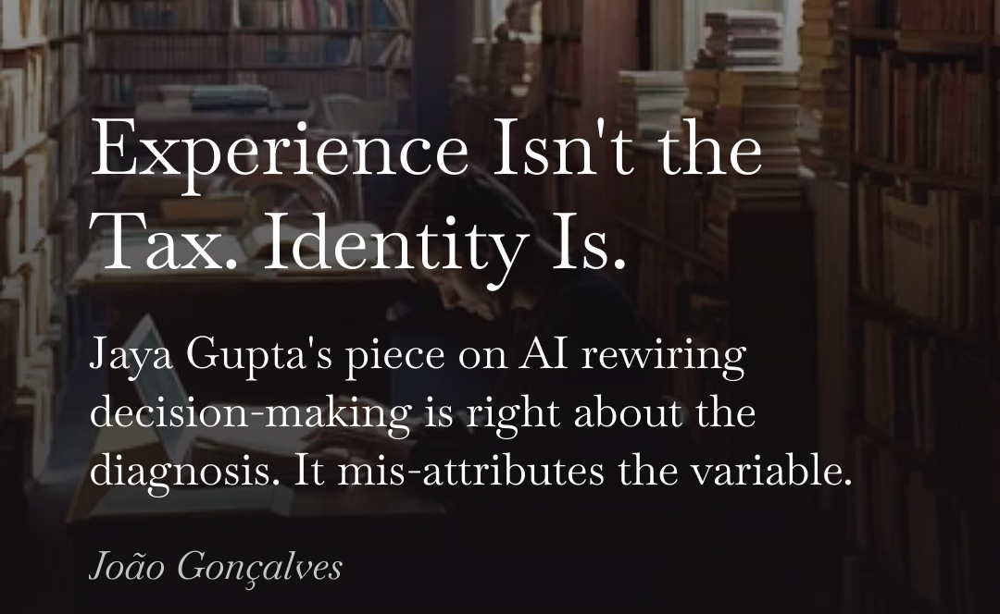

Everyone framing AI adoption as a generational story has the variable wrong.

It isn't age. It isn't years on the CV. It's identity weight. How much of your self is attached to your last public call.

You can spot the operators who've un-taxed themselves by behavior. They run their own experiments instead of delegating prompts to a junior. They reverse without ego. The last decision was a hypothesis, not a stake. They use the tool to attack their own priors, not confirm them. They've stopped leading meetings with "in my experience" because they noticed the phrase shuts the conversation down before anyone tests whether the analogy fits.

Some 50-year-olds never lost clarity. Some 22-year-olds are already losing it.

The discipline is identifiable by behavior, not years on a CV.

Wrote about why Jaya Gupta's "experience is a tax" piece nailed the diagnosis and missed the variable: https://joaofogoncalves.com/articles/2026/04/2026-04-28-experience-isnt-the-tax-identity-is/

**Hashtags:** #AI #Leadership #AIAdoption

---

## Media

