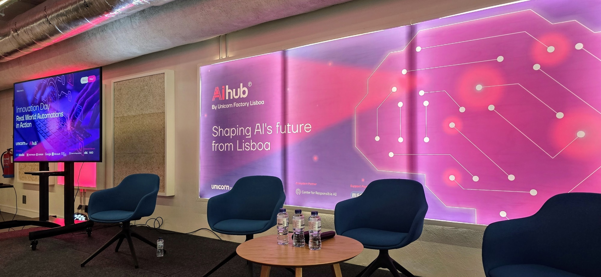
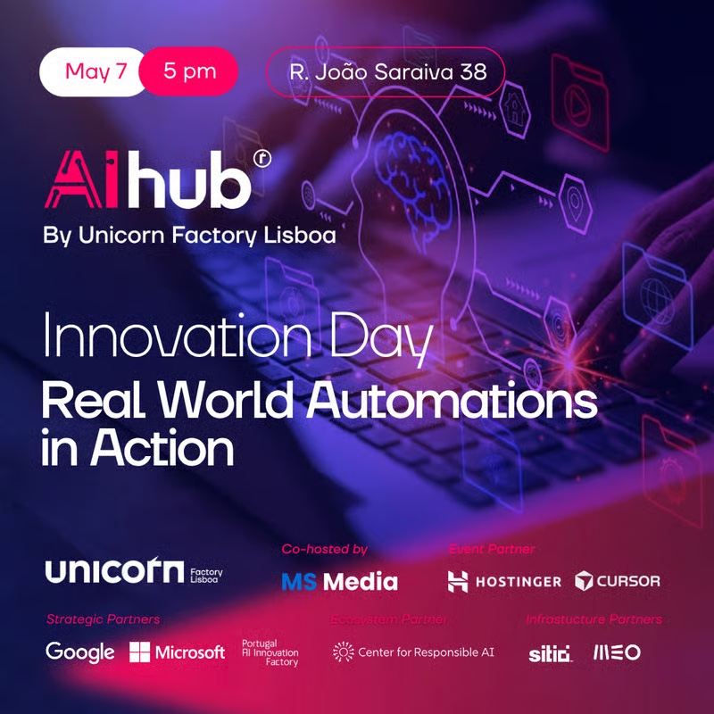

AI is everywhere. Agents inside products are still rare.

Yesterday's AI Innovation Day at AIhub Lisbon flipped that ratio. Five flash demos, all forced through the same filter: problem → solution → impact.

I sat on the jury and the demos that stood out weren't the ones with the slickest UI or the biggest model. They were the ones where an agent was actually doing work inside the product flow. Picking up tasks. Making decisions. Handing off to the human only when it mattered.

That's the gap most teams are still staring at: shipping a chatbot is one project, wiring an agent into your operational loop is a completely different one.

Thanks [Unicorn Factory Lisboa](https://www.linkedin.com/company/unicornfactorylisboa/) and [Max Steinbrenner](https://www.linkedin.com/in/maximilian-st-5b993810a/) for the invite, and for picking a format that filters for substance.

**Hashtags:** #AI #AIAgents #Automation #Lisbon

---

## Media

