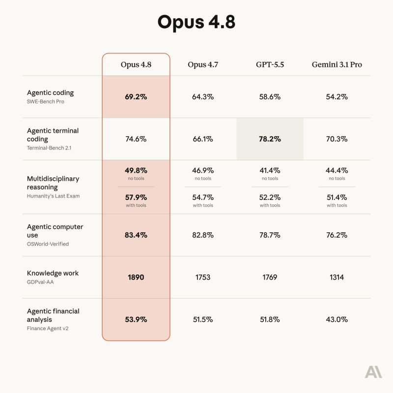

# May 30, 2026

Claude Opus 4.8 is live. 
Comes with better scores, specially for longer tasks.

Anthropic has also expanded the rate limits to allow the same workloads to be completed with 4.8 on xhigh or above.

Time to give it a spin.

---

## Media

---

[View original post on LinkedIn](https://www.linkedin.com/feed/update/urn:li:activity:7465810825090498560/)