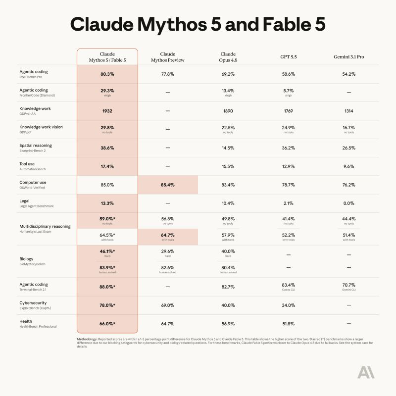

# June 15, 2026

Claude 5 is here !
Named Fable it's a Mythos-class model that was made safe for general use.

Its capabilities exceed those of any model Anthropic ever made generally available.

Fable 5 scored state-of-the-art on nearly all tested benchmarks, with exceptional performance in software engineering, knowledge work, scientific research, and vision.

The longer and more complex the task, the larger Fable 5’s lead over other models from Anthropic. 

Finally we can test the Mythos-class and see if the hype and just hype or it really os a step forward. 

hashtag
#AI 
hashtag
#Claude

**Hashtags:** #AI #Claude

---

## Media

---

[View original post on LinkedIn](https://www.linkedin.com/feed/update/urn:li:activity:7470181385874419714/)