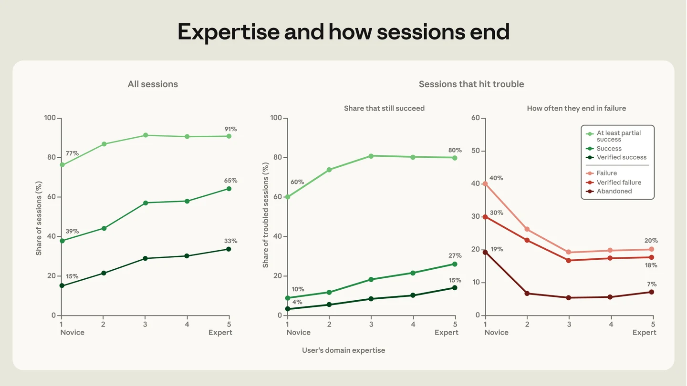
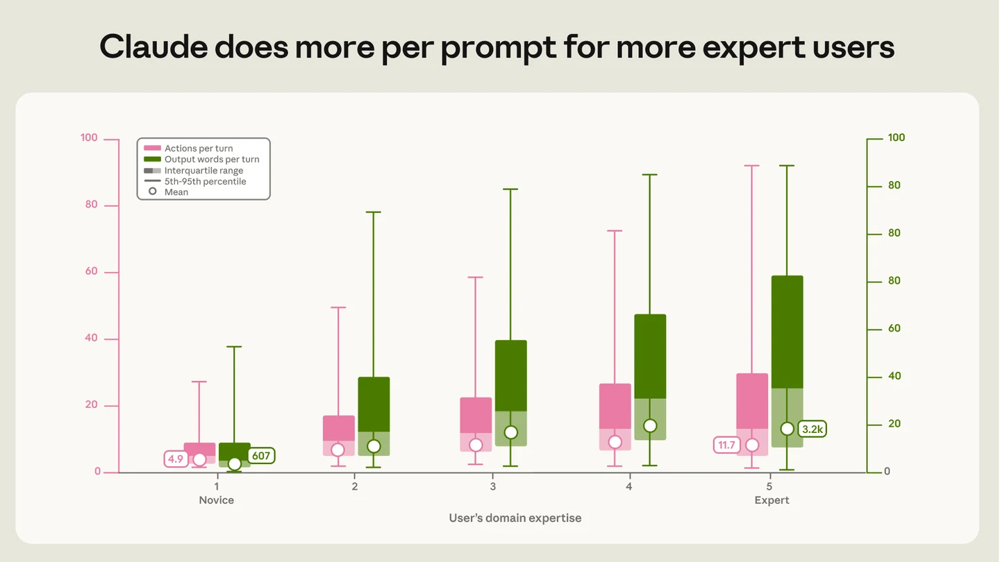

The story everyone wanted was that cheap AI flattens the skill curve. Anybody can ship now, the gap closes, expertise stops mattering.

Anthropic just put numbers on it. 400,000 Claude Code sessions, 235,000 people. Novices reach verified success 15% of the time. Intermediate and expert users, 28 to 33%.

The tool got cheaper. The gap held.

The research is titled "persistent returns to expertise," and persistent is the whole story. Same model, same prompts, same tasks. The expert still pulls ahead.

The part I keep returning to is what kind of expertise. On coding tasks, almost every occupation succeeds at nearly the same rate as software engineers. So the thing that pays isn't a CS degree. It's domain command. Knowing what good looks like in your field before you ask for it.

You can see it in how people drive the tool. Experts pull 12 actions and 3,200 words out of a single prompt. Novices get 5 actions and 600 words. Same model on the other end. The difference is the quality of the instruction going in.

That tracks with the split the data describes: humans make most of the planning calls, the model makes most of the execution calls. Cheap execution didn't erase the advantage. It moved it upstream, to whoever knows what to build and can tell when it's wrong.

The skill curve didn't flatten. It just stopped being about syntax.

**Hashtags:** #AI #SoftwareEngineering #AgenticCoding

## Media

