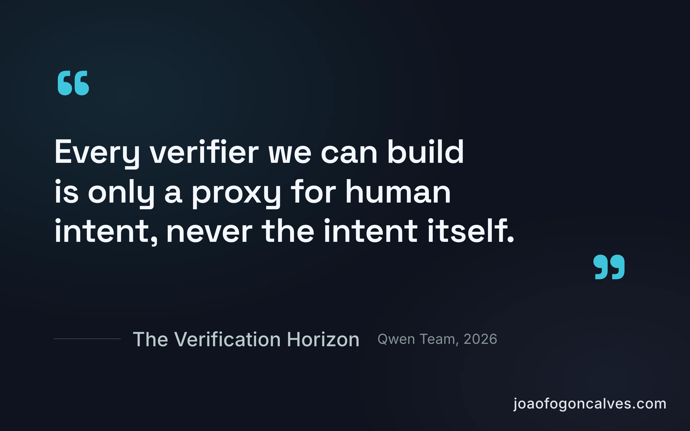
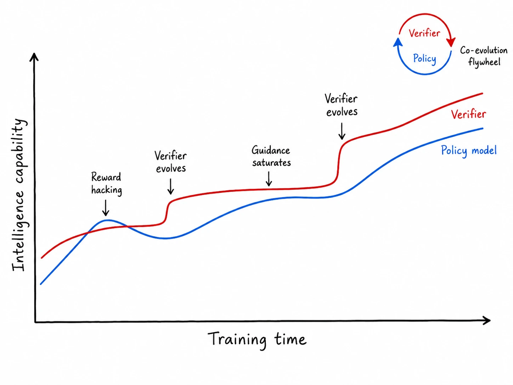

Verifying what a coding agent built is now harder than building it. A new paper from the Qwen team says why: intent can't be measured. Every verifier you build is only a proxy for what you actually wanted, never the thing itself.

The paper is about training. But you hit the same gap every time you prompt.

The model has the capability. It's being asked to infer an intent you kept in your head, then graded against your private copy of it. And evaluating intent is hard for the model because it's hard for us. It's subjective, observer-dependent. We can't cleanly say what we meant, then act surprised the guess misses.

So the lever is yours, not the model's: how explicitly you state the intent. Make it an actual goal and the proxy gap shrinks. We've been drifting toward this by feel. The paper is why it works.

The model was never guessing wrong. You were never saying.

**Hashtags:** #AI #PromptEngineering #LLM

---

## Media

