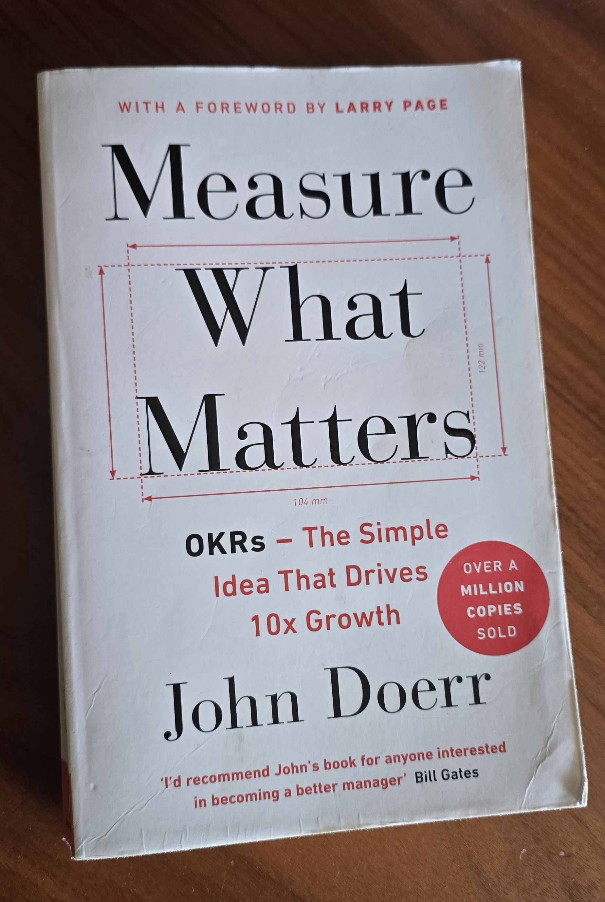
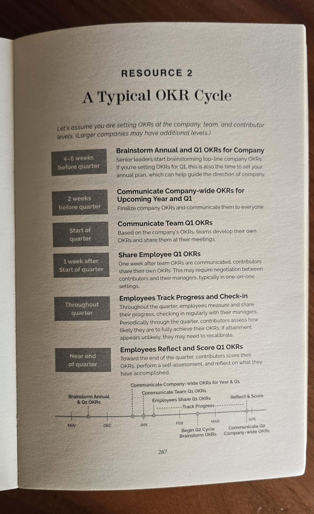

Finished "Measure What Matters" this week. The OKR mechanics, the Intel discipline, the Google stories: all exactly as advertised.

The surprise was how much of the book isn't about measurement at all.

Doerr pairs OKRs with CFRs: conversations, feedback, recognition. Roughly half the book argues the goal system only works when a human system runs underneath it. Regular one-on-ones. Feedback that arrives while it's still useful. Recognition that's specific instead of ceremonial.

Most teams that adopt OKRs import the spreadsheet half and skip the CFR half. Then the quarterly ritual turns into scoring theater, and the framework takes the blame.

The measurement system runs on the part nobody measures.

**Hashtags:** #OKRs #Leadership #EngineeringManagement

---

## Media

