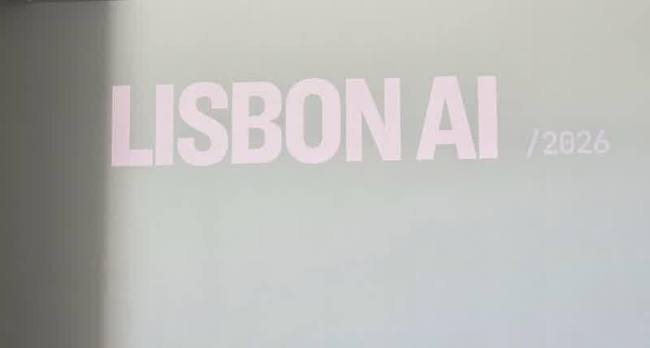
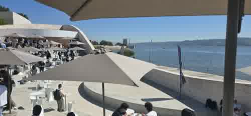

Lisbon AI sells itself as a builders summit, and the schedule makes that claim do real work. Talks from people who maintain agent runtimes, eval loops, and open models in production sit next to hallway time on a Champalimaud terrace overlooking the Tagus, with about 400 attendees and an explicit ask to bring a laptop.

I'm here on day one. The venue is nicer than most conference hotels, which helps, but the design constraint underneath is denser: pack people who already ship into one place and treat the stage as secondary to the conversations that happen between sessions.

If the scarce thing at AI events is usually production scars in the room, this one seems built around that shortage.

**Hashtags:** #AI #SoftwareEngineering #LisbonAI

---

## Media

