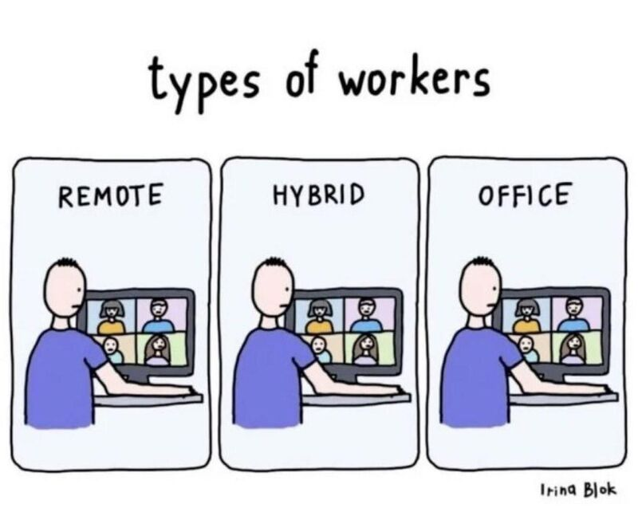

# March 27, 2024

After reading this great post from Ethan Evans I had to write something about how remote work has become the new norm.

https://lnkd.in/d26NGZu7

Much has been said about benefits/disadvantages for the companies, but what about the people?

1️⃣ Work-Life Harmony: Remote work empowers you to design your day, striking the perfect balance between work and personal life. No more long commutes, more time for family, hobbies, and self-care.

 2️⃣ Productivity Prowess: Embrace your preferred work environment, be it your home office or your favorite coffee shop. A comfortable setting can supercharge your productivity, unleashing your full potential.

3️⃣ Flexibility Reigns: Tech professionals thrive on adaptability. Remote work provides the flexibility to adjust your work hours, accommodating different time zones and optimizing your performance.

4️⃣ Reduced Stress: By eliminating the daily grind of commuting and office politics, remote work can significantly reduce stress levels, promoting mental well-being.

5️⃣ Customized Workspace: Create a workspace that mirrors your personality and preferences. A personalized environment can ignite creativity and boost your morale.

PS: What's the one thing you love most about your remote work setup? Share your favorite perk!

hashtag
#remotework 
hashtag
#workfromhome 
hashtag
#carrer
--------
If you like this content and it is useful to you, repost this and follow me João Gonçalves for more like it.

**Hashtags:** #carrer #remotework #workfromhome

---

## Media

---

[View original post on LinkedIn](https://www.linkedin.com/feed/update/urn:li:activity:7117242529959358464/)