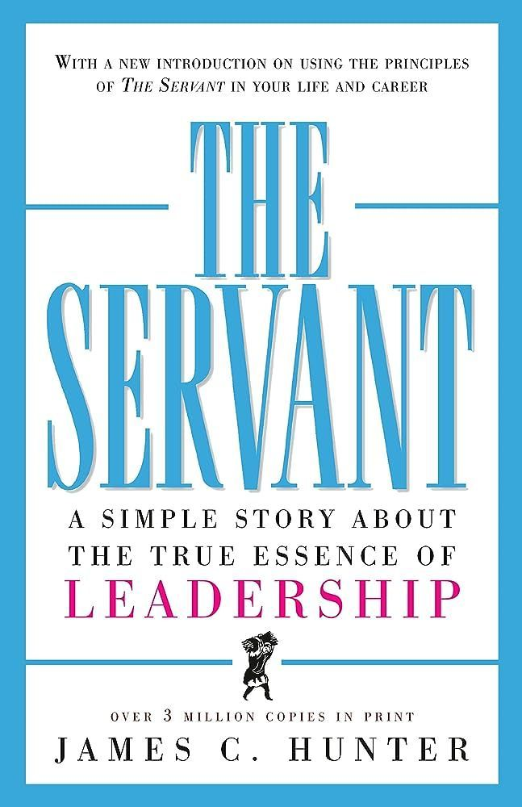
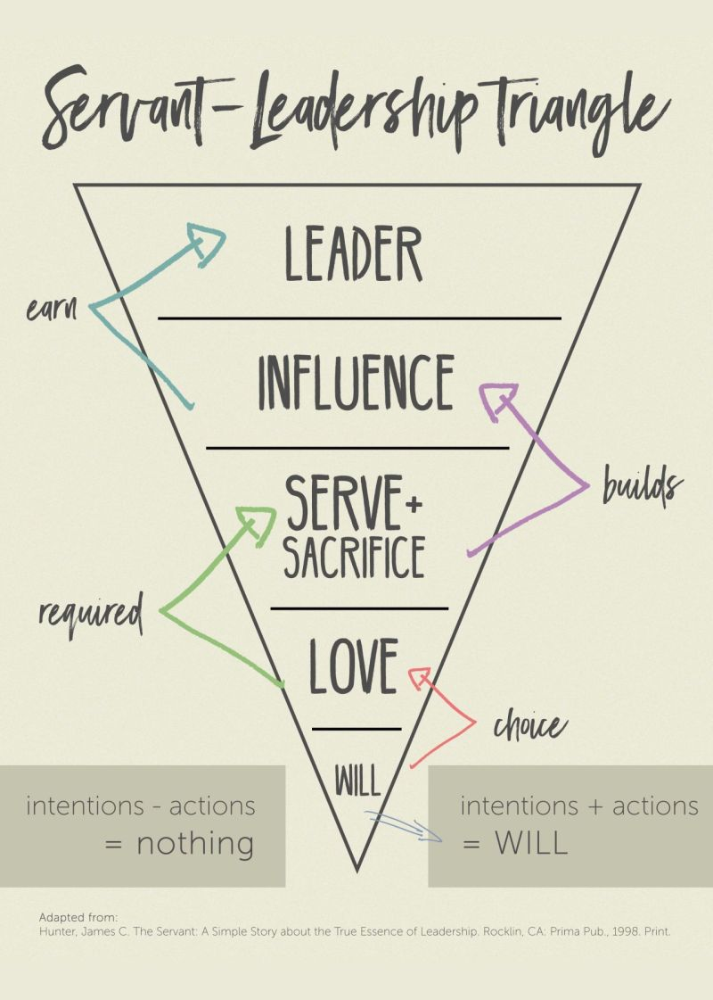

# March 27, 2024

📚 Book Review: "The Servant: A Simple Story About the True Essence of Leadership"

Not a recent read, but a very important one. A couple of months ago I
digged into "The Servant" by James C. Hunter, and it's not just a book on leadership; it's a journey to the heart of what leadership should truly be. 🌟

This remarkable book presents leadership as a triangle, where the foundation is built on love – love for one another, love for the work, and love for the mission. Here are some profound insights that resonated with me:

🔺 Foundation of Love: At the base of this leadership pyramid is love. Love for people, not as mere cogs in a machine, but as individuals with unique aspirations and needs. When we lead with love, we create a workplace where trust flourishes, and teams thrive.

🔺 Listening and Empathy: By genuinely hearing the concerns and aspirations of our team members, we strengthen the bonds that hold our pyramid together. Empathy is the bridge that connects us to our colleagues and fosters collaboration.

🔺 Service as Leadership: Leadership is not about wielding power; it's about serving others. True leaders put the needs (but not the wants) of their team members first and empower them to reach their full potential. This servant leadership approach can transform organizations and inspire greatness.

This book beautifully illustrates that leadership isn't about titles or authority; it's about influence and impact. It challenges us to reevaluate our approach and consider how we can build our own triangle, rooted in love and service.
As we ascend this pyramid, let's remember that love is not just a feeling but an action. It's about selflessness, understanding, and compassion for the people we work with and serve.

And a big thank you to my beautiful wife Maria Albernaz who gave me this book that spoke so deeply to me. 

Have you explored "The Servant"? What are your thoughts on the leadership pyramid and the role of love in leadership? 
Let's discuss in the comments below! 📖💡
 

hashtag
#Leadership 
hashtag
#BookReview 
hashtag
#LoveInLeadership

**Hashtags:** #BookReview #LoveInLeadership #Leadership

---

## Media

---

[View original post on LinkedIn](https://www.linkedin.com/feed/update/urn:li:activity:7106389536741502976/)