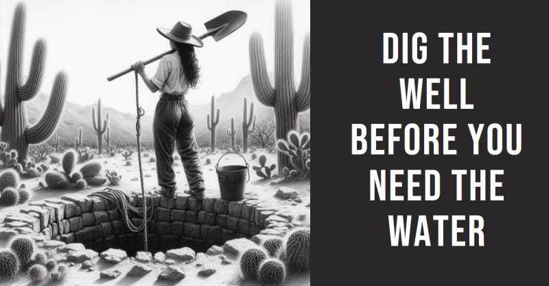

# March 27, 2024

Dig the Well Before You Need the Water

This is one of my favorite sayings, and it's a reminder that we should always be looking ahead and preparing for the future. 
It's easy to get caught up in the day-to-day grind and forget to think about what might come up down the road. But by taking steps today to prepare for potential challenges, we can avoid being caught off guard and give ourselves more options when things don't go according to plan.

This saying also has a deeper meaning. It's about taking action today that will give us more options in the future. 
For example, if we're thinking about starting a business, we need to start taking steps now to learn about the industry, build a network of contacts, and develop a business plan. By doing this, we'll be more likely to succeed when we're ready to launch our business.

The same principle applies to our personal lives. If we want to be more successful, we need to take action now to develop our skills, build our relationships, and set goals for ourselves. By doing this, we'll be more likely to achieve our dreams and goals.

So, the next time you're feeling overwhelmed or discouraged, remember to dig the well before you need the water. Take action today that will give you more options in the future. You won't regret it.

Here are a few specific ways to dig the well before you need the water:

- 𝗗𝗲𝘃𝗲𝗹𝗼𝗽 𝘆𝗼𝘂𝗿 𝘀𝗸𝗶𝗹𝗹𝘀: Take courses, read books, and attend workshops to learn new skills that will be valuable in your career or personal life.
- 𝗕𝘂𝗶𝗹𝗱 𝘆𝗼𝘂𝗿 𝗻𝗲𝘁𝘄𝗼𝗿𝗸: Attend industry events, join professional organizations, and connect with people who can help you achieve your goals.
- 𝗦𝗲𝘁 𝗴𝗼𝗮𝗹𝘀: Create a clear vision for your future and set specific, measurable, achievable, relevant, and time-bound (SMART) goals to help you achieve it.

By taking these steps, you can set yourself up for success and avoid being caught off guard by challenges in the future. 

Remember, it's never too early to start digging the well!

hashtag
#personalgrowth 
hashtag
#takeactionnow 
hashtag
#bestadvice 
--------
-> this content useful to you, repost ♻ 
-> you want more like it, follow me João Gonçalves

**Hashtags:** #bestadvice #personalgrowth #takeactionnow

---

## Media

---

[View original post on LinkedIn](https://www.linkedin.com/feed/update/urn:li:activity:7155825303246823424/)