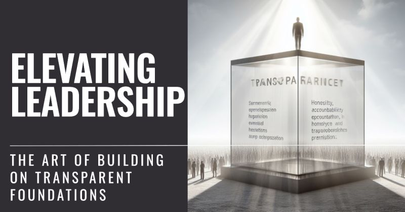

# March 27, 2024

Elevating Leadership: The Art of Building on Transparent Foundations

Transparency isn't just an option; it's the essential bedrock upon which successful leadership stands. It's the cornerstone that, when harnessed effectively, elevates not only your role as a leader but also the entire team's potential. 

Let's explore how weaving transparency into the fabric of your leadership can elevate your team's performance and your personal growth.

𝟭. 𝗧𝗿𝘂𝘀𝘁 𝗕𝘂𝗶𝗹𝗱𝗲𝗿: Transparency is the foundation of trust. When your team knows what's happening, they trust your decisions. It's the bedrock upon which strong leadership stands. Think of it as the mortar that holds your team's trust in place, brick by brick.

𝟮. 𝗖𝗼𝗹𝗹𝗮𝗯𝗼𝗿𝗮𝘁𝗶𝗼𝗻 𝗖𝗮𝘁𝗮𝗹𝘆𝘀𝘁: Openness fosters collaboration. Share your vision and watch your team unite to achieve it. Transparent leaders create an environment where collaboration isn't a chore but a natural outcome. It's like teamwork on steroids!

𝟯. 𝗟𝗲𝗮𝗿𝗻𝗶𝗻𝗴 𝗟𝗼𝗼𝗽: Transparent leaders encourage feedback and learning. Mistakes become growth opportunities. When your team knows that admitting an error won't lead to blame but rather a chance to learn and improve, they're more likely to push boundaries and innovate.

𝟰. 𝗘𝗺𝗽𝗼𝘄𝗲𝗿𝗺𝗲𝗻𝘁 𝗘𝗻𝗴𝗶𝗻𝗲: An informed team is an empowered team. Give them the tools to drive success. Transparency empowers your team members to make decisions on their own, confident in the knowledge that they're in sync with the broader goals.

𝟱. 𝗩𝗶𝘀𝗶𝗼𝗻 𝗦𝗵𝗮𝗿𝗽𝗲𝗻𝗶𝗻𝗴: Clear communication of goals and values ensures everyone is on the same page. Think of transparency as the lens through which your team sees your vision. When that vision is crystal clear, it becomes a powerful magnet, pulling everyone in the same direction.

Transparency is more than a leadership buzzword; it's your toolkit for building a robust, high-performing team. As a leader, you wield this power to cultivate trust, boost collaboration, fuel learning, empower your team, and sharpen your collective vision.

So, as you lead, remember that transparency isn't a weakness; it's your strength. It's not just about sharing information; it's about creating an environment where your team can thrive.

How do you foster transparency in your team? Share your thoughts! 

hashtag
#leadership 
hashtag
#transparency 
hashtag
#leadershipdevelopment
--------
-> this content useful to you, repost ♻ 
-> you want more like it, follow me João Gonçalves

**Hashtags:** #leadership #transparency #leadershipdevelopment

---

## Media

---

[View original post on LinkedIn](https://www.linkedin.com/feed/update/urn:li:activity:7121407515489107969/)