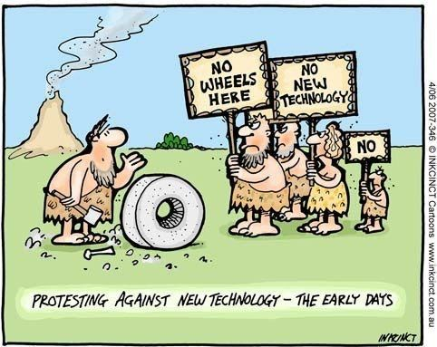

# March 27, 2024

💡 Embracing Innovation: A Historical Perspective 🚀

Opposition to new technology is a tale as old as time, and it's a fascinating journey through history. Let's delve into the past to appreciate the transformations that once faced resistance and skepticism.

In the 18th century, during the dawn of the Industrial Revolution, a group known as the Luddites gained notoriety for their opposition to the mechanization of the textile industry. They believed that machines were taking away their livelihoods, leading to the destruction of machinery in protest. Little did they know that this very industrialization would pave the way for unprecedented economic growth and improved living standards.

Take coffee, for example, a beloved morning companion for many. Believe it or not, it was once seen as a threat to productivity, leading to moral and health concerns. Today, it fuels countless productive days and social interactions.

Recorded music faced its own resistance when the phonograph was introduced. Critics argued that recorded music lacked the warmth and authenticity of live performances. Yet, it went on to become a cornerstone of entertainment, revolutionizing the music industry.

Then there's refrigeration, a staple in our kitchens. In the early days, it was met with apprehension due to concerns about safety and its impact on food quality. Today, it's a household essential, preventing food waste and ensuring our meals stay fresh.

Now, as we stand at the cusp of a new era, renewable energy sources, like wind and solar power, encounter their fair share of skepticism. Just as the Luddites feared automation, some question the reliability and economic viability of renewables. However, they hold the key to a sustainable future.

Heat pumps, transforming our homes with efficient heating and cooling, are met with curiosity and caution. Electric vehicles (EVs), the future of transportation, face range anxiety and infrastructure challenges. But as history teaches us, these technologies have the potential to redefine our way of life.

One constant is that once society fully embraces these innovations, we tend to forget the opposition they once faced. It's a testament to human adaptability and the remarkable progress that technology can bring.

Let's keep this historical perspective in mind as we navigate the ever-changing landscape of technology. Embracing change, even in the face of initial doubts, has been a catalyst for progress throughout history. The next breakthrough might be just around the corner! 🔌 

hashtag
#Innovation 
hashtag
#TechnologyEvolution 
hashtag
#EmbraceChange

**Hashtags:** #Innovation #TechnologyEvolution #EmbraceChange

---

## Media

---

[View original post on LinkedIn](https://www.linkedin.com/feed/update/urn:li:activity:7106744484415049728/)