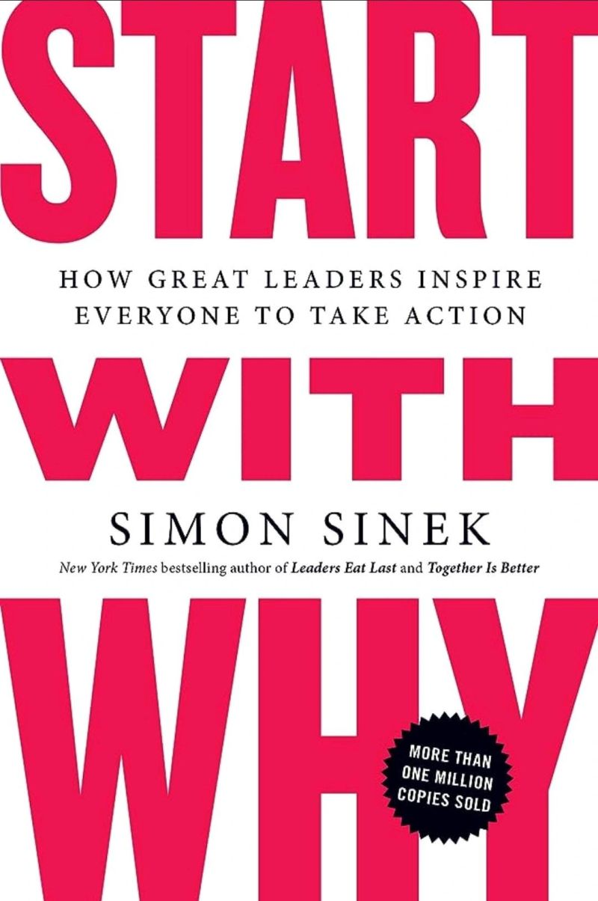

# March 27, 2024

📚 Finished reading "Start with Why", and as promised, here are my thoughts. 🌟

This book is a powerful reminder that in both our personal and professional lives, the "why" behind what we do is what truly matters. Sinek's Golden Circle concept, with its focus on the core purpose and beliefs, is a game-changer for anyone looking to lead with purpose.

💡 The core message is clear: Great leaders and organizations don't just focus on what they do or how they do it, but they start with WHY. It's a simple yet profound concept that can reshape how we approach business, leadership, and life.

🔍 In the Golden Circle concept, Sinek brilliantly illustrates why character, wrapped within the "why," is so crucial. The "what" and "how" may define what a company does and how it does it, but the "why" defines its character and values. Building trust, an essential element of leadership, often hinges on character. When you lead with a clear sense of purpose and values, trust naturally follows. People want to align themselves with individuals and organizations that stand for something greater than just profit or efficiency.

🌐 Whether you're an aspiring entrepreneur, a seasoned leader, or someone seeking personal growth, "Start with Why" offers valuable lessons. It reminds us that purpose-driven endeavors have the potential to create meaningful change in the world. When we lead with character, integrity, and a deep sense of "why," we not only inspire trust but also motivate others to join us in our journey.

Thank you, Simon Sinek, for this thought-provoking read! 🙌
 
hashtag
#StartWithWhy 
hashtag
#Leadership 
hashtag
#BookReview

**Hashtags:** #BookReview #StartWithWhy #Leadership

---

## Media

---

[View original post on LinkedIn](https://www.linkedin.com/feed/update/urn:li:activity:7103849008908910592/)