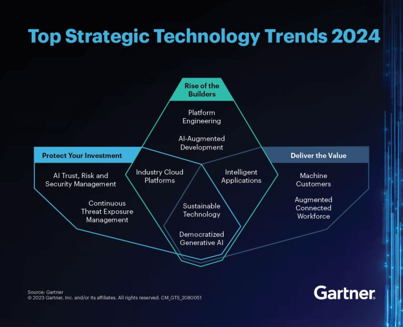

# March 27, 2024

Gartner's Top 10 Strategic Technology Trends for 2024

Gartner has released its list of the top 10 strategic technology trends for 2024, and it's a fascinating read. The trends highlight the growing importance of artificial intelligence (AI), cloud computing, and other emerging technologies in the business world.

Trends are organized under 3 main themes businesses should focus on:

1: Protect your investment
Protecting their investments in AI by implementing AI Trust, Risk and Security Management (AI TRiSM). This will help them to build trust with their customers and partners, and to avoid potential risks.

2: Rise of the builders
Building the right AI solutions for their needs. This means understanding their business goals and choosing the right AI technologies to achieve those goals.

3: Deliver the value
Delivering value to their customers through AI. This means using AI to improve their products and services, and to create new customer experiences.

These trends are all having a major impact on the way businesses operate, and they are likely to continue to do so in the years to come. If you're interested in learning more about these trends, I encourage you to read the full article. (link in the comments)

hashtag
#innovation 
hashtag
#trends 
hashtag
#technology 
hashtag
#ai
--------
If you like this content and it is useful to you, repost this and follow me João Gonçalves for more like it.

**Hashtags:** #trends #ai #innovation #technology

---

## Media

---

[View original post on LinkedIn](https://www.linkedin.com/feed/update/urn:li:activity:7120659083971432449/)