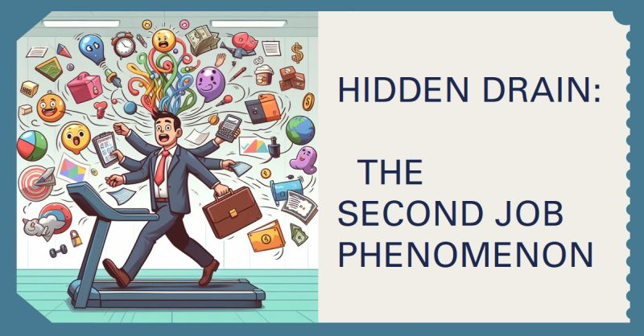

# March 27, 2024

In every organization, there's a silent drain on resources, a phenomenon known as the second job. 

Your first job is crystal clear—it's the one you were hired for, the one you're paid to do. Achieving, performing, exceeding expectations—it's all part of the game.

𝗕𝘂𝘁 𝘄𝗵𝗮𝘁 𝗮𝗯𝗼𝘂𝘁 𝘁𝗵𝗲 𝘀𝗲𝗰𝗼𝗻𝗱 𝗷𝗼𝗯? 🤔

Psychologists Robert Kegan and Lisa Lahey (Minds at Work), in "An Everyone Culture," delve into this intriguing concept. It's where energy is stealthily spent covering weaknesses, managing impressions, playing politics, and hiding uncertainties.

Imagine if organizations created space to halt this second job. What if they said, "We hired you for your goodness, not perfection. We're here to get better, and that includes making mistakes."

The benefits of dismantling the second job phenomenon are far-reaching. Organizations can expect:

- 𝗘𝗻𝗵𝗮𝗻𝗰𝗲𝗱 𝗖𝗿𝗲𝗮𝘁𝗶𝘃𝗶𝘁𝘆 𝗮𝗻𝗱 𝗣𝗿𝗼𝗯𝗹𝗲𝗺-𝗦𝗼𝗹𝘃𝗶𝗻𝗴: When individuals feel comfortable sharing their ideas and perspectives, regardless of their perceived shortcomings, creativity and problem-solving can flourish.

- 𝗗𝗲𝗲𝗽𝗲𝗿 𝗟𝗲𝗮𝗿𝗻𝗶𝗻𝗴 𝗮𝗻𝗱 𝗗𝗲𝘃𝗲𝗹𝗼𝗽𝗺𝗲𝗻𝘁: A culture of transparency and support encourages individuals to take on new challenges, learn from mistakes, and continuously grow.

- 𝗦𝘁𝗿𝗼𝗻𝗴𝗲𝗿 𝗖𝗼𝗹𝗹𝗮𝗯𝗼𝗿𝗮𝘁𝗶𝗼𝗻 𝗮𝗻𝗱 𝗧𝗲𝗮𝗺𝘄𝗼𝗿𝗸: When people feel safe to be their true selves, they can build stronger relationships, collaborate more effectively, and achieve shared goals.

- 𝗥𝗲𝗱𝘂𝗰𝗲𝗱 𝗦𝘁𝗿𝗲𝘀𝘀 𝗮𝗻𝗱 𝗜𝗺𝗽𝗿𝗼𝘃𝗲𝗱 𝗪𝗲𝗹𝗹-𝗯𝗲𝗶𝗻𝗴: The burden of constantly hiding imperfections takes a toll on mental and physical health. A culture of authenticity and acceptance fosters well-being and reduces stress.

Let's rewrite the narrative. Lead by example, encourage authenticity, and watch your team flourish. 

hashtag
#leadership 
hashtag
#teamempowerment 
hashtag
#growthmindset 
--------
-> this content useful to you, repost ♻ 
-> you want more like it, follow me João Gonçalves

**Hashtags:** #growthmindset #leadership #teamempowerment

---

## Media

---

[View original post on LinkedIn](https://www.linkedin.com/feed/update/urn:li:activity:7148215158077652993/)