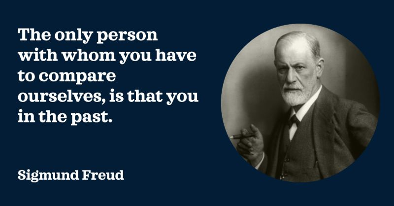

# March 27, 2024

In the pursuit of personal growth, we often compare ourselves to others, seeking external validation. 

However, true self-improvement lies in comparing ourselves to our past selves. As Freud said, "The only person with whom you have to compare ourselves, is that you in the past. And the only person better you should be, this is who you are now." 

Embracing this concept shifts the focus to internal growth, encouraging us to celebrate our triumphs, acknowledge setbacks as learning opportunities, and commit to continuous improvement.

1. Self-Reflection Matters:
Take a moment each week to reflect on your progress. Celebrate your wins and learn from challenges. Your journey is a testament to your growth.

2. Continuous Learning:
Leadership is a dynamic field. Expand your knowledge beyond your comfort zone. Embrace diverse perspectives; it's the catalyst for both personal and team development.

3. Own Your Leadership Style:
There's no one-size-fits-all approach to leadership. Tailor your methods to suit your team's dynamics. Authenticity fosters trust and resonates with your team.

4. Celebrating Small Victories and Learning from Setbacks:
Acknowledge and celebrate the small wins—they are the building blocks of significant achievements. Equally, view setbacks as opportunities for learning and growth. Every experience contributes to your leadership journey.

Strive to be a better version of yourself, not someone else. 🌱

In your pursuit of excellence, remember that the applause you seek is within your own achievements. 
Measure success by your growth, not by external benchmarks.

hashtag
#personalgrowth 
hashtag
#leadership 
hashtag
#freud 
--------
-> this content useful to you, repost ♻ 
-> you want more like it, follow me João Gonçalves

**Hashtags:** #leadership #freud #personalgrowth

---

## Media

---

[View original post on LinkedIn](https://www.linkedin.com/feed/update/urn:li:activity:7135286914021998592/)