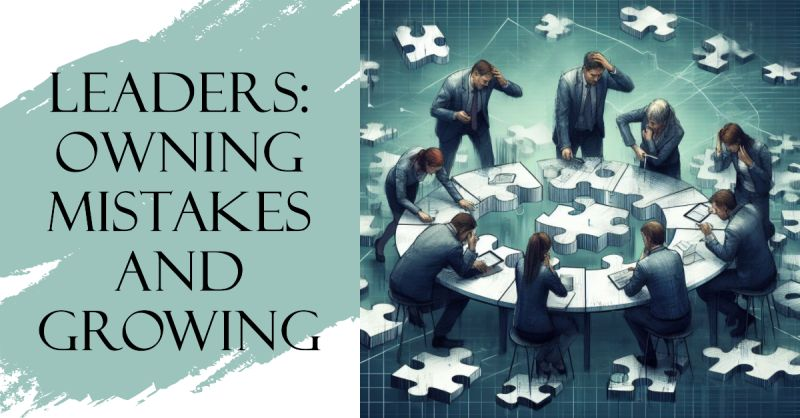

# March 27, 2024

Leaders: Owning Mistakes and Growing

As leaders, we all make mistakes when interacting with other people. 🤷‍♂️ It's a part of being human, but it's also a defining moment for any leader. How we handle those mistakes can set the tone for our entire team.

Here's a simple 5-step guide for navigating those challenging moments:

1️⃣ Acknowledge your mistake, own it. Transparency is the cornerstone of trust within a team. When you're upfront about your slip-ups, it fosters an environment where others feel comfortable doing the same. 🤝

2️⃣ Apologize. A sincere apology can mend fences faster than you think. It's not a sign of weakness; it's a sign of strength and empathy. It shows that you care about the impact of your actions. 🙏

3️⃣ Find common ground for resolution. Sometimes, disagreements arise from different perspectives or priorities. As a leader, it's your role to facilitate a productive conversation and find a solution that everyone can support. 🔍

4️⃣ Figure out what triggered the miscommunication. Understanding the 'why' behind the mistake can prevent similar hiccups in the future. It's not just about fixing the immediate issue but also preventing its recurrence. 🤔

5️⃣ Take actions to prevent similar events in the future. Learning from our mistakes is the path to growth. Implement processes, provide training, or introduce new communication channels to ensure the same mistake doesn't happen again. 🌱

Remember, leadership isn't about being perfect. It's about owning your flaws and striving for improvement with transparency. It's about creating a culture of continuous learning and growth within your team.

Share your experiences and let's learn from each other. Leadership is an ongoing journey, and there's always room for improvement. Together, we can grow stronger.

hashtag
#mistakes 
hashtag
#apology 
hashtag
#leadership
--------
-> this content useful to you, repost ♻ 
-> you want more like it, follow me João Gonçalves

**Hashtags:** #apology #leadership #mistakes

---

## Media

---

[View original post on LinkedIn](https://www.linkedin.com/feed/update/urn:li:activity:7128276275437142016/)