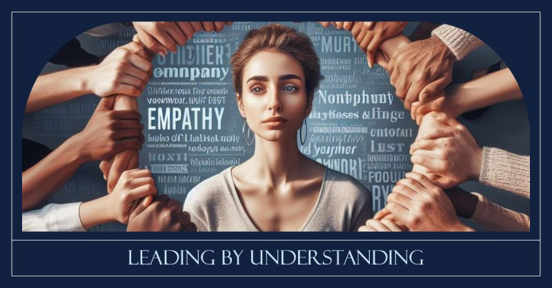

# March 27, 2024

Leading by Understanding: The Power of Empathy ❤️

The heart of team success – leading with empathy. Empathy isn't just a buzzword and it isn't just about understanding emotions.

it's about using that understanding to empower your team.
It's about being attuned to your team's unique needs and adapting your leadership style accordingly.
It's about connecting with your team on a human level, understanding their needs, and working together towards success.

Here's a practical guide:

- Walk in Their Shoes: 
To lead with empathy, you need to understand your team's journey. Take the time to listen, ask questions, and appreciate their challenges. This builds trust and a sense of camaraderie. 

- Open Communication: Foster an environment where team members feel comfortable expressing their thoughts and feelings. Open lines of communication build stronger connections. 

- Active Listening: Empathy starts with listening, not just hearing. Pay attention to your team's concerns, ideas, and feedback. Make them feel valued by showing that their voices matter. 

- Support and Adapt: Empathetic leaders adapt to their team's needs. If someone is struggling, offer support and guidance. Tailor your leadership style to help them thrive.

- Lead by Example: Show your team what empathy looks like in action. When they see you treating others with kindness and respect, they'll follow suit. 

By leading with empathy, you'll not only achieve success but also create a workplace where everyone can grow and flourish. 

P.S. How do you practice empathy in your leadership role? 
Share your tips and experiences in the comments. Let's learn from each 
other! 🌟 

hashtag
#leadership 
hashtag
#sucess 
hashtag
#teamwork 
hashtag
#bestadvice 
--------
If you like this content and it is useful to you, repost this and follow me João Gonçalves for more like it.

**Hashtags:** #leadership #bestadvice #teamwork #sucess

---

## Media

---

[View original post on LinkedIn](https://www.linkedin.com/feed/update/urn:li:activity:7118105522804813824/)