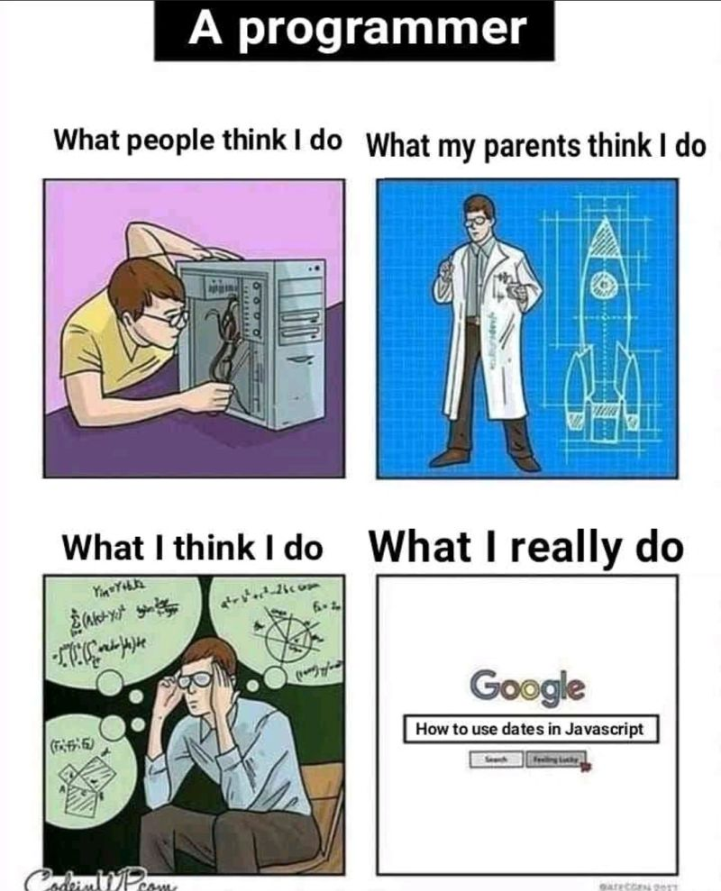

# March 27, 2024

Managing timezones and dates in software development can be a daunting task! 🌐⏰

I've faced this challenge firsthand 🫠, both as a developer dealing with existingcode and data, and as a leader, trying to define a coherent strategy for the team.
It's not just about coding; it's about ensuring a seamless user experience and data accuracy, so having a clear plan is crucial. 

So, to my fellow tech leaders and engineers out there, here's a challenge: 
Share your timezone handling wisdom, or your horror stories 😈, in the comments below! 

Let's build a knowledge base to conquer this timezone maze together. 🚀

hashtag
#SoftwareDevelopment 
hashtag
#Timezones 
hashtag
#TechLeadership 
hashtag
#ShareYourWisdom

**Hashtags:** #TechLeadership #Timezones #SoftwareDevelopment #ShareYourWisdom

---

## Media

---

[View original post on LinkedIn](https://www.linkedin.com/feed/update/urn:li:activity:7108385208696999936/)