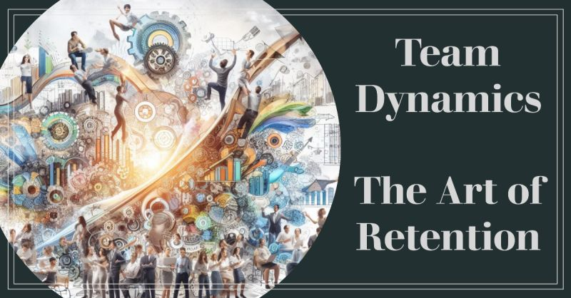

# March 27, 2024

Team Dynamics: The Art of Retention

Crafting a high-performing team is an exercise of honing and retaining top talent, transcending beyond mere seat-filling. 
As a Team Leader, navigating the intricacies of scaling while retaining brilliance is a journey. Here are key insights to amplify your team's success:

🌟 𝗗𝗲𝗳𝗶𝗻𝗲 𝗬𝗼𝘂𝗿 𝗜𝗱𝗲𝗻𝘁𝗶𝘁𝘆: Your company's culture is its essence. Clearly articulate values and principles, attracting like-minded individuals and fostering long-term commitment.

🧩 𝗧𝗵𝗲 𝗣𝗲𝗿𝗳𝗲𝗰𝘁 𝗠𝗮𝘁𝗰𝗵: Prioritize cultural alignment in hiring. Beyond skills, seek individuals resonating with your values, ensuring a recipe for enduring success.

🌐 𝗘𝗺𝗯𝗿𝗮𝗰𝗲 𝗗𝗶𝘃𝗲𝗿𝘀𝗶𝘁𝘆: Cultivate a tech team with diverse perspectives. This fosters innovation and inclusivity, a synergy benefiting both talent and organization.

🤝 𝗟𝗶𝗳𝗲𝗹𝗼𝗻𝗴 𝗟𝗲𝗮𝗿𝗻𝗶𝗻𝗴: Invest in continuous professional development. Nurture a culture of growth, offering opportunities for training and certifications to attract and retain top talent.

🌎 𝗥𝗲𝗺𝗼𝘁𝗲 𝗥𝗲𝘃𝗼𝗹𝘂𝘁𝗶𝗼𝗻: Embrace remote work to access a global talent pool. This flexibility is a game-changer in acquiring exceptional talent.

🧰 𝗘𝗾𝘂𝗶𝗽 𝗳𝗼𝗿 𝗦𝘂𝗰𝗰𝗲𝘀𝘀: Provide cutting-edge tools and resources. This not only boosts productivity but also underscores your commitment to valuing your team's contributions.

🔁 𝗙𝗲𝗲𝗱𝗯𝗮𝗰𝗸 𝗛𝗮𝗿𝗺𝗼𝗻𝘆: Instill a culture rich in feedback. Regular one-on-ones, performance evaluations, and open communication channels are pivotal for growth and retention.

💼 𝗖𝗮𝗿𝗲𝗲𝗿 𝗥𝗼𝗮𝗱𝗺𝗮𝗽𝘀: Define transparent career pathways. Ensure your top talent envisions growth and advancement opportunities within your organization.

🙌 𝗖𝗲𝗹𝗲𝗯𝗿𝗮𝘁𝗲 𝗪𝗶𝗻𝘀: Recognize and appreciate your team's triumphs. A simple "thank you" resonates profoundly, motivating and engaging your top talent.

Sculpting a triumphant team is an art. Elevate your team-building game, embrace these insights, and witness your tech team soar to new heights. 

hashtag
#teambuilding 
hashtag
#leadership
--------
-> this content useful to you, repost ♻ 
-> you want more like it, follow me João Gonçalves

**Hashtags:** #leadership #teambuilding

---

## Media

---

[View original post on LinkedIn](https://www.linkedin.com/feed/update/urn:li:activity:7132631724580044801/)