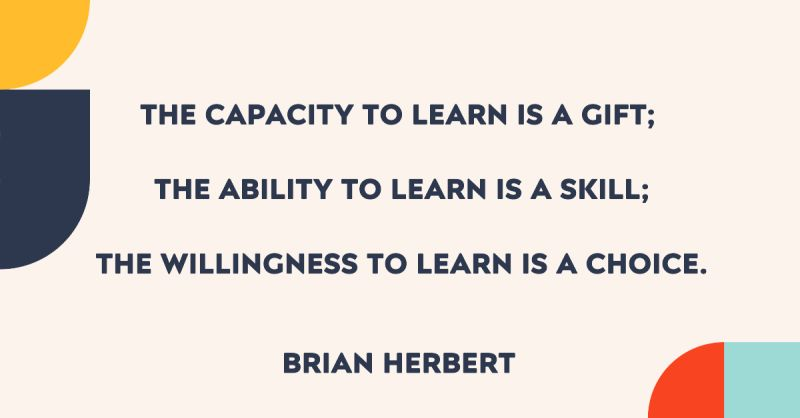

# March 27, 2024

"The capacity to learn is a gift; the ability to learn is a skill; the willingness to learn is a choice." A gem, penned by Brian Herbert.

Think about it: we're all born with the potential to learn, the gift of a curious mind. But to truly unlock that potential, we need to develop the skill of effective learning. It's about knowing how to absorb information, retain it, and apply it.

Yet, the most powerful element is the choice. We can choose to embrace curiosity, to step outside our comfort zones and seek new knowledge. We can choose to see challenges as opportunities to learn and grow.

Here's how this translates to your professional life:

- 𝗘𝗺𝗯𝗿𝗮𝗰𝗲 𝗹𝗶𝗳𝗲𝗹𝗼𝗻𝗴 𝗹𝗲𝗮𝗿𝗻𝗶𝗻𝗴: Don't stop at your formal education. Take online courses, attend workshops, read industry publications.

- 𝗗𝗲𝘃𝗲𝗹𝗼𝗽 𝘆𝗼𝘂𝗿 𝗹𝗲𝗮𝗿𝗻𝗶𝗻𝗴 𝘀𝗸𝗶𝗹𝗹𝘀: Explore different learning methods, find what works for you. Experiment with active learning techniques like discussions or projects.

- 𝗖𝗵𝗼𝗼𝘀𝗲 𝗴𝗿𝗼𝘄𝘁𝗵 𝗼𝘃𝗲𝗿 𝗰𝗼𝗺𝗳𝗼𝗿𝘁: Don't shy away from difficult topics or new experiences. Remember, the biggest learning often comes from pushing boundaries.

- 𝗦𝗵𝗮𝗿𝗲 𝘆𝗼𝘂𝗿 𝗸𝗻𝗼𝘄𝗹𝗲𝗱𝗴𝗲: By teaching others, you solidify your own understanding and inspire a culture of learning.

So, make the choice to unlock your learning potential. It's a gift, a skill, and a superpower waiting to be unleashed.

hashtag
#lifelonglearning 
hashtag
#growthmindset 
hashtag
#professionaldevelopment
--------
-> this content useful to you, repost ♻ 
-> you want more like it, follow me João Gonçalves

**Hashtags:** #growthmindset #professionaldevelopment #lifelonglearning

---

## Media

---

[View original post on LinkedIn](https://www.linkedin.com/feed/update/urn:li:activity:7167783347627278337/)