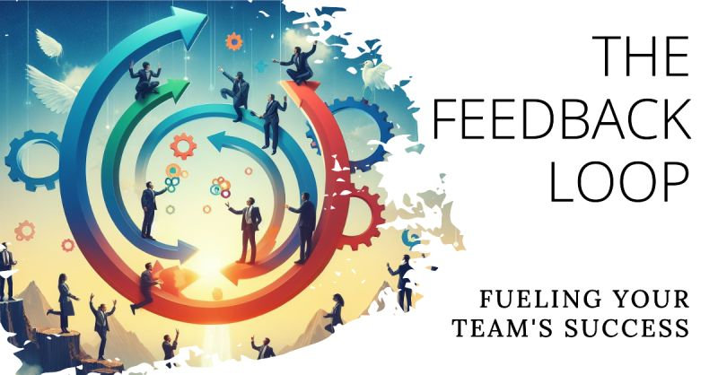

# March 27, 2024

The Feedback Loop: Fueling Your Team's Success

Ever heard champions don't win on talent alone? They thrive on continuous improvement, and that fuel comes from one key ingredient: feedback.

As leaders, we have the responsibility to foster a culture where feedback is embraced, not dreaded. Here are some tips to get you started:

- 𝗦𝗽𝗲𝗰𝗶𝗳𝗶𝗰𝗶𝘁𝘆 𝗶𝘀 𝗞𝗲𝘆: Ditch the generic "good job" or "needs work." Focus on concrete examples of what someone did well or could improve on.
- 𝗧𝗶𝗺𝗲𝗹𝗶𝗻𝗲𝘀𝘀 𝗠𝗮𝘁𝘁𝗲𝗿𝘀: The sooner you provide feedback, the fresher the memory and the easier it is to act on it. ⏰
- 𝗙𝗼𝗰𝘂𝘀 𝗼𝗻 𝗜𝗺𝗽𝗿𝗼𝘃𝗲𝗺𝗲𝗻𝘁: Frame feedback as a way to help people grow, not criticize them.
- 𝗕𝗲 𝗢𝗽𝗲𝗻 𝘁𝗼 𝗙𝗲𝗲𝗱𝗯𝗮𝗰𝗸 𝗧𝗼𝗼: Remember, we all make mistakes and can learn from others. Be receptive to what your team has to say.

𝗧𝗵𝗲 𝗕𝗲𝗻𝗲𝗳𝗶𝘁𝘀 𝗼𝗳 𝗘𝗳𝗳𝗲𝗰𝘁𝗶𝘃𝗲 𝗙𝗲𝗲𝗱𝗯𝗮𝗰𝗸:

A healthy feedback loop can lead to:

- 𝗜𝗻𝗱𝗶𝘃𝗶𝗱𝘂𝗮𝗹 𝗚𝗿𝗼𝘄𝘁𝗵: Sharpen your own skills and knowledge through constructive criticism.
- 𝗘𝗮𝗿𝗹𝘆 𝗣𝗿𝗼𝗯𝗹𝗲𝗺 𝗦𝗼𝗹𝘃𝗶𝗻𝗴: Identify and address challenges before they snowball.
- 𝗦𝘁𝗿𝗼𝗻𝗴𝗲𝗿 𝗧𝗲𝗮𝗺𝘀: Build trust and rapport through open communication.
- 𝗣𝗼𝘀𝗶𝘁𝗶𝘃𝗲 𝗪𝗼𝗿𝗸 𝗘𝗻𝘃𝗶𝗿𝗼𝗻𝗺𝗲𝗻𝘁: Create a space where everyone feels comfortable learning and growing together.

𝗕𝘂𝗶𝗹𝗱𝗶𝗻𝗴 𝗮 𝗙𝗲𝗲𝗱𝗯𝗮𝗰𝗸 𝗖𝘂𝗹𝘁𝘂𝗿𝗲:

Leaders set the tone! Here's how you can champion feedback within your team:

- 𝗟𝗲𝗮𝗱 𝗯𝘆 𝗘𝘅𝗮𝗺𝗽𝗹𝗲: Be open to receiving feedback yourself and actively solicit it from your team.
- 𝗖𝗿𝗲𝗮𝘁𝗲 𝗮 𝗦𝗮𝗳𝗲 𝗦𝗽𝗮𝗰𝗲: Foster an environment where people feel comfortable giving and receiving honest feedback without fear of repercussions.

𝗟𝗲𝘁'𝘀 𝗱𝗶𝘀𝗰𝘂𝘀𝘀! How do you encourage a culture of feedback within your team? Share your tips and experiences in the comments below!

hashtag
#leadership 
hashtag
#teamculture 
hashtag
#feedback 
--------
-> this content useful to you, repost ♻ 
-> you want more like it, follow me João Gonçalves

**Hashtags:** #teamculture #leadership #feedback

---

## Media

---

[View original post on LinkedIn](https://www.linkedin.com/feed/update/urn:li:activity:7172890776530628609/)