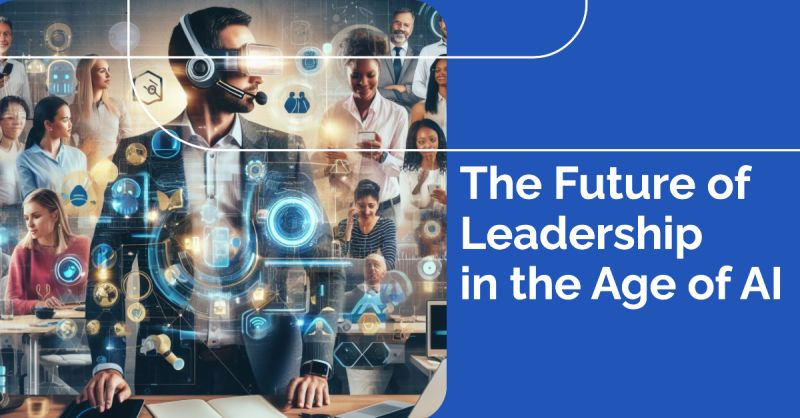

# March 27, 2024

The Future of Leadership in the Age of AI

AI continues to revolutionize industries and reshape the world around us, and its impact on leadership is becoming increasingly evident. 
While it is undoubtedly transforming the way we work, it is not destined to replace human leaders altogether. Instead, it is creating a new paradigm of leadership that demands a blend of distinctly human skills and technological expertise.

In the age of AI, effective leadership is not about competing with machines but rather about harnessing their capabilities to augment human strengths. AI excels at analyzing vast amounts of data, identifying patterns, and automating tasks, freeing up human leaders to focus on higher-order thinking, creativity, and strategic decision-making.

The leaders who will thrive in this new era will possess a unique combination of qualities, including:

𝗘𝗺𝗼𝘁𝗶𝗼𝗻𝗮𝗹 𝗜𝗻𝘁𝗲𝗹𝗹𝗶𝗴𝗲𝗻𝗰𝗲: AI may surpass humans in computational power, but it lacks the capacity for empathy, compassion, and emotional understanding. Leaders must leverage their emotional intelligence to build strong relationships, foster a sense of purpose and belonging within their teams, and navigate complex ethical considerations arising from AI implementation.

𝗔𝗱𝗮𝗽𝘁𝗮𝗯𝗶𝗹𝗶𝘁𝘆 𝗮𝗻𝗱 𝗔𝗴𝗶𝗹𝗶𝘁𝘆: The rapid pace of technological change demands leaders who are comfortable with ambiguity, embrace new ideas, and adapt quickly to evolving circumstances. AI will introduce new challenges and opportunities, and leaders must be nimble enough to seize these opportunities while mitigating potential risks.

𝗦𝘁𝗿𝗮𝘁𝗲𝗴𝗶𝗰 𝗩𝗶𝘀𝗶𝗼𝗻 𝗮𝗻𝗱 𝗖𝗿𝗶𝘁𝗶𝗰𝗮𝗹 𝗧𝗵𝗶𝗻𝗸𝗶𝗻𝗴: AI can provide valuable insights and inform decision-making, but it cannot replace the human ability to think critically, analyze complex situations, and envision a strategic path forward. Leaders must be able to interpret AI-generated data, identify biases, and make sound judgments that align with the organization's overall goals.

𝗖𝗿𝗲𝗮𝘁𝗶𝘃𝗶𝘁𝘆 𝗮𝗻𝗱 𝗜𝗻𝗻𝗼𝘃𝗮𝘁𝗶𝗼𝗻: AI can automate routine tasks, but it cannot match human creativity and ingenuity. Leaders must foster a culture of innovation within their organizations, encouraging employees to explore new ideas, challenge assumptions, and develop groundbreaking solutions.

Redefining the Role of Leadership

In the age of AI, the role of leadership is not about micromanaging tasks or dictating directions. Instead, it is about inspiring, empowering, and guiding teams to achieve shared goals. Leaders must act as facilitators, creating an environment where human and AI capabilities can synergize to drive innovation, enhance productivity, and navigate the ever-changing landscape of the future.

As AI continues to permeate every aspect of our lives, the need for effective leadership has never been greater.

hashtag
#leadership 
hashtag
#ai
--------
-> this content useful to you, repost ♻ 
-> you want more like it, follow me João Gonçalves

**Hashtags:** #leadership #ai

---

## Media

---

[View original post on LinkedIn](https://www.linkedin.com/feed/update/urn:li:activity:7130161933109854208/)