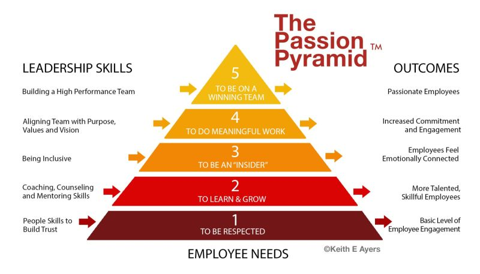

# March 27, 2024

The Passion Pyramid: Fueling Team Passion for Maximum Impact 🔥

Employee engagement is one of the current buzzwords. But what if I told you there's a way to take it up a notch, to ignite not just interest but pure, unbridled passion in your team? 🚀

Renowned scholar Gary Hamel proposes a paradigm shift. He asserts that a passionate employee isn't just engaged but adds value beyond expectations and wholeheartedly embraces the organizational mission. 🌟

According to the Integro Leadership Institute, 78% of engaged employees are passionate about their duties. However, only 44% are passionate about both their job and the organization simultaneously. The key? Emotional attachment. 💓

Enter the Passion Pyramid – a roadmap to inspire and nurture passion, driving higher performance levels. Here are the five building blocks:

1️⃣ Building trust and respect
2️⃣ Fostering learning and growth
3️⃣ Igniting emotional connections through communication
4️⃣ Infusing Purpose, Vision, and Values
5️⃣ Cultivating a growth-driven mentality

So, how can you utilize the Passion Pyramid to craft exceptional teams?

Start with trust and respect. Then, equip your team with skills and confidence. Help them see the bigger picture, aligning with shared values. Encourage ownership of the organization's goals. And finally, provide the motivation and direction for them to unleash their passion. 

In summary, the Passion Pyramid is the path to nurturing passionate, high-performing teams. It transcends mere training and development, creating a framework for passionate performance at all levels. 💪

Are you ready to ascend the Passion Pyramid? Share your thoughts below! 

hashtag
#employeeretention 
hashtag
#employeeengagement 
hashtag
#growth 
hashtag
#leadership
--------
If you like this content and it is useful to you, repost this and follow me João Gonçalves for more like it.

**Hashtags:** #growth #leadership #employeeengagement #employeeretention

---

## Media

---

[View original post on LinkedIn](https://www.linkedin.com/feed/update/urn:li:activity:7119556065771290624/)