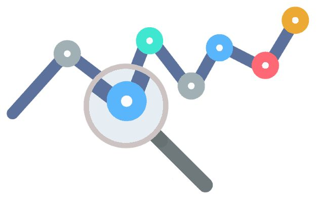

# March 27, 2024

The Power of Pull Request Traceability
In the dynamic realm of software development, traceability is the glue that holds our progress together.

📌 **Why a Change Was Made:** Understanding the 'why' behind each code change is a crucial cornerstone of traceability. It's not just about lines of code; it's about the mission. When we can clearly articulate the purpose of a pull request, it enhances collaboration, decision-making, and helps us maintain the bigger picture.

👤 **Who Made the Change:** People are at the heart of every project. Traceability means knowing who contributed what. It's about recognizing and celebrating the individual talents and collective efforts that bring software to life. It fosters accountability and builds a strong team identity.

📅 **When the Change Was Released:** Time is of the essence in the tech world. Traceability ensures that we can pinpoint when a particular change was integrated into the codebase and released to users. This is invaluable for troubleshooting, bug fixes, and regulatory compliance.

🤝 **What Other Changes Were Released Together:** Context is king. Knowing which changes were bundled together in a release can prevent conflicts, regressions, and unintended consequences. It's like having a roadmap that guides us through the intricate landscape of code evolution.

In today's fast-paced development environments, and whether you are using Github Issues, Gitlab, Trello, Jira, etc.. traceability isn't a luxury; it's a necessity. It ensures your code is not just a collection of characters but a well-documented journey of decisions and innovations. Embrace traceability, and you'll empower your team to build better, collaborate smarter, and deliver with confidence. 🚀

These topics are also well covered and with clear examples in the GitHub post
https://lnkd.in/d7K9_XEu

hashtag
#Traceability 
hashtag
#SoftwareDevelopment 
hashtag
#Collaboration 
hashtag
#CodingJourney 
hashtag
#TechInnovation

**Hashtags:** #CodingJourney #SoftwareDevelopment #Traceability #TechInnovation #Collaboration

---

## Media

---

[View original post on LinkedIn](https://www.linkedin.com/feed/update/urn:li:activity:7100468463315369984/)