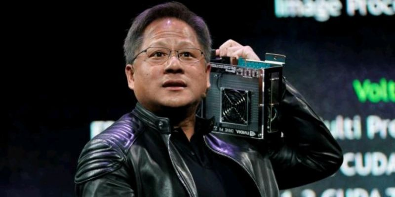

# March 27, 2024

🚀 The uncomventional leadership style of Jensen Huang at NVIDIA :

1️⃣ Flat Organization:
 - With an impressive 40 direct reports and a rather unconventional approach of no 1:1 meetings, Huang fosters a flat organizational structure. He firmly believes that empowering the entire team starts from the top, challenging traditional hierarchical norms.
 - Interestingly, career advice isn't on his agenda. He trusts his management team to make the best decisions for their careers, acknowledging their exceptional abilities.

2️⃣ Communication Revolution:
 - Huang's approach to communication is refreshingly unique. Instead of relying on status reports, he "stochastically samples the system." In other words, he prefers to stay connected with the unfiltered reality of the organization, rather than polished updates.
 - He encourages transparency and accessibility by inviting anyone in the company to email him their "top five things" that are top of mind. This open-door policy ensures that important insights don't get filtered through layers of hierarchy.
 - Meetings at NVIDIA aren't exclusive to VPs or Directors. Huang encourages inclusivity, believing that everyone should have access to all the context, all the time. He openly addresses issues and engages in public reasoning, fostering a culture of collaboration and information sharing.

3️⃣ Agile Planning:
 - Unlike organizations with strict planning cycles, Nvidia operates without a formal 5-year or 1-year plan. This adaptability allows them to respond swiftly to the ever-changing dynamics of the tech industry, particularly in the fast-paced realm of artificial intelligence.
 
This approach optimizes NVIDIA for (1) attracting top talent, (2) maintaining a lean team, and (3) ensuring rapid information flow. 

hashtag
#Leadership 
hashtag
#Innovation 
hashtag
#Nvidia

**Hashtags:** #Innovation #Leadership #Nvidia

---

## Media

---

[View original post on LinkedIn](https://www.linkedin.com/feed/update/urn:li:activity:7107445411967041536/)