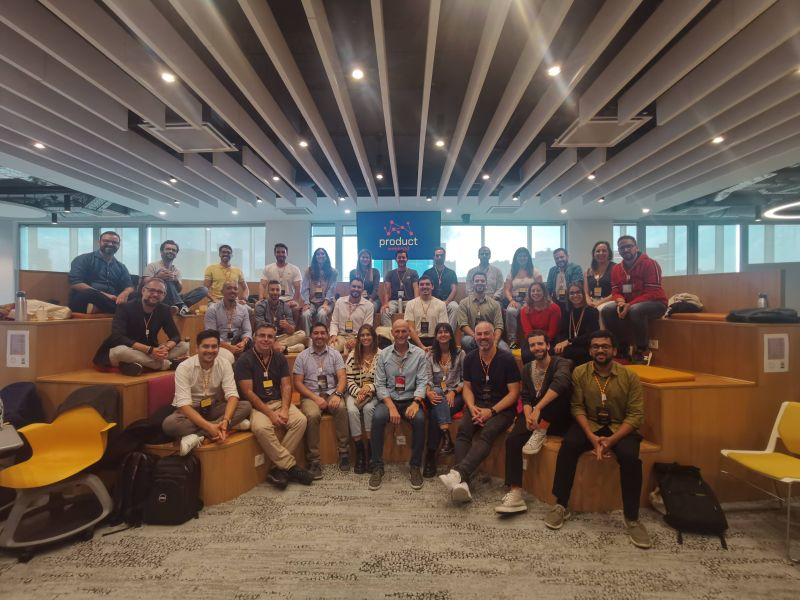
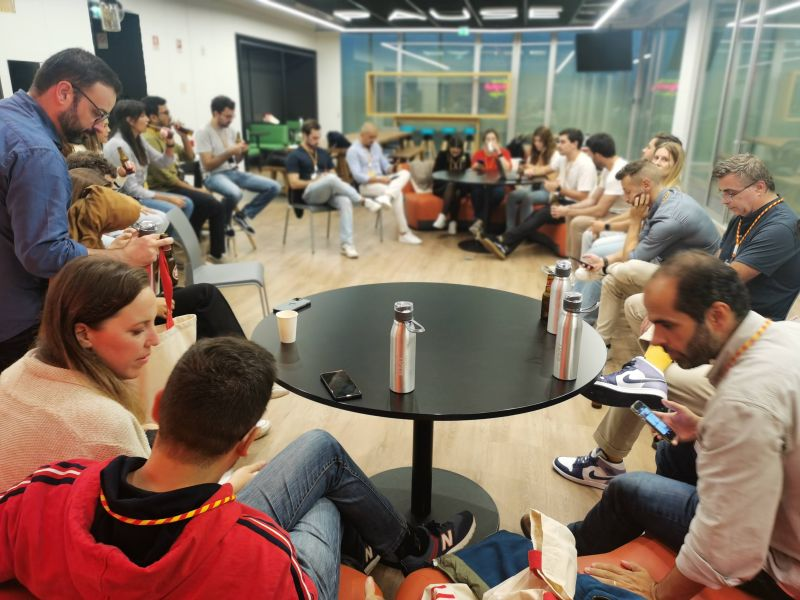
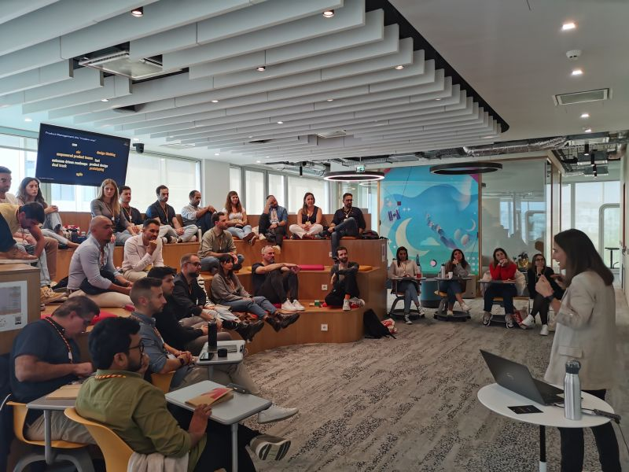

# March 27, 2024

This was a very different, but enlightening weekend. 

I spent two days surrounded by smart, energetic, and insightful people at Product Circle (formerly Product Weekend).

"But wait, what is an Engineering Leader doing in a product event?" I can almost hear the gasps and see the faces of perplexity.

Fear not, I'm not joining the Dark Side, but I do believe in reaching across knowledge chasms and finding new insights outside my comfort zone. 
I believe in truly diverse teams that work together toward a common goal. And the better we can talk and understand each other, the better the end product.

The talks were amazing:
- Iuri Figueiredo shared a super interesting concept of "The Translator" to improve communication within a team.

- Andre Albuquerque subverted expectations and gave contrarian (that I 100% agree with) views on product management.

- Tim Gregory showed us the difficulties of finding the best way to slice a problem in a scaled organization.

- Clara Rivero Machado told an inspiring story of how persistence and competence can change the culture of an incumbent company.

- Ricardo Luiz gave a no-BS view on user-centric products, emphasizing that involving everyone in the full product lifecycle leads to products that are not just cool, but loved and used by users.

And all this was only possible with the outstanding organization of Joao Moita.

I felt very welcome, and actually found that I had things to add and share from a different perspective, which were surprisingly well-received by the group.

This leaves me no choice but to thank everyone there for the wonderful experience, and to start thinking about the next time I can join.

hashtag
#product 
hashtag
#productmanagement

**Hashtags:** #productmanagement #product

---

## Media

---

[View original post on LinkedIn](https://www.linkedin.com/feed/update/urn:li:activity:7124521360541765632/)