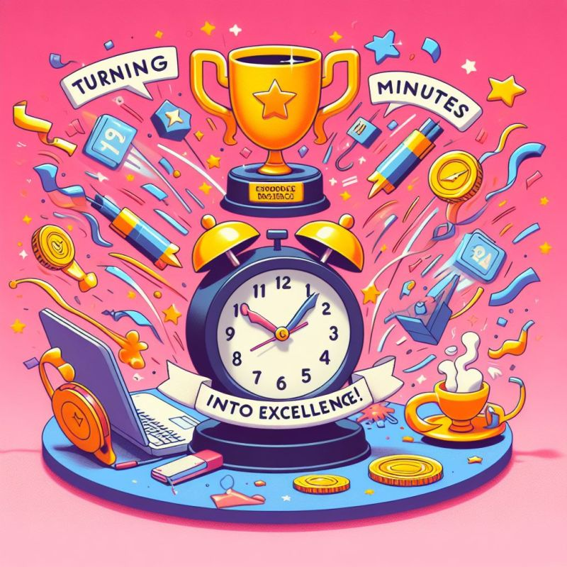

# March 27, 2024

Transforming Minutes into Excellence

I stumbled upon a gem on the No Dumb Questions Podcast, with Destin Sandlin and Matt Whitman: 
"𝗜𝗳 𝘆𝗼𝘂 𝘁𝗮𝗸𝗲 𝗰𝗮𝗿𝗲 𝗼𝗳 𝘁𝗵𝗲 𝗺𝗶𝗻𝘂𝘁𝗲𝘀, 𝘁𝗵𝗲 𝗵𝗼𝘂𝗿𝘀 𝘄𝗶𝗹𝗹 𝘁𝗮𝗸𝗲 𝗰𝗮𝗿𝗲 𝗼𝗳 𝘁𝗵𝗲𝗺𝘀𝗲𝗹𝘃𝗲𝘀" – attributed to Lord Chesterfield. 🎙️

It struck a chord with me and I think it holds profound implications for leadership. By meticulously tending to the details of our daily tasks—those seemingly insignificant minutes—we lay the groundwork for excellence in the larger, more intricate aspects of our work. It's a philosophy that resonates deeply with how we steer our teams. 🚀

Here's a quick snapshot of how this principle translates into effective leadership:

𝗗𝗲𝘁𝗮𝗶𝗹-𝗢𝗿𝗶𝗲𝗻𝘁𝗲𝗱 𝗟𝗲𝗮𝗱𝗲𝗿𝘀𝗵𝗶𝗽: Focusing on the minutiae fosters a culture of precision within your team, ensuring that every aspect of a project receives due attention.

𝗤𝘂𝗮𝗹𝗶𝘁𝘆 𝗶𝗻 𝗖𝗼𝗺𝗽𝗹𝗲𝘅𝗶𝘁𝘆: A meticulous approach to small tasks naturally extends to more complex challenges, creating a ripple effect of high-quality output.

𝗧𝗲𝗮𝗺 𝗘𝗺𝗽𝗼𝘄𝗲𝗿𝗺𝗲𝗻𝘁: Encouraging your team to embrace this mindset cultivates a collective dedication to excellence, where everyone plays a vital role in the pursuit of perfection.

Remember, leadership is about more than just overseeing; it's about setting the tone for a culture of excellence. As leaders, let's prioritize the minutes, confident that the hours will follow suit. ⏰

What are your thoughts on this approach? How do you integrate attention to detail into your leadership style? 

Ps: give that podcast a listen, it's well worth the time.

hashtag
#leadership 
hashtag
#excellence 
--------
-> this content useful to you, repost ♻ 
-> you want more like it, follow me João Gonçalves

**Hashtags:** #leadership #excellence

---

## Media

---

[View original post on LinkedIn](https://www.linkedin.com/feed/update/urn:li:activity:7137703141474467841/)